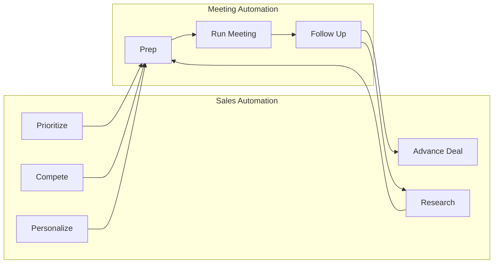

# Market Research Document — Version 1 (JTBD Decomposition)

## Document Info

| Field | Value |
|-------|-------|
| Version | v1 |
| Use Case | Use Case 3: Sales Enablement & Meeting Automation Crew |
| Focus | Jobs To Be Done — Sales Automation + Meeting Automation |
| Parent Artifact | `project-context/1.define/mrd.md` (market research) |
| Course Context | Maven Agentic AI Architect — Lesson 4 Capstone |

---

## Purpose

This document decomposes the Sales Enablement & Meeting Automation Crew use case into **Jobs To Be Done (JTBD)** across two domains:

1. **Sales Automation** — pipeline, research, intelligence, and deal motion outside the meeting
2. **Meeting Automation** — preparation, execution support, capture, and follow-up around scheduled interactions

It complements the quantitative market research in `mrd.md` and informs PRD user stories, agent definitions, and MVP scope decisions.

---

## How the Two Domains Connect

**Sales automation** keeps the deal moving across the pipeline.  
**Meeting automation** is the high-intensity moment where prep, execution, and follow-up either accelerate or stall the deal.

They share context (account, stakeholders, competitive landscape), which is why a **multi-agent crew with shared memory** fits better than separate point tools.

---

# Part 1: Sales Automation — Jobs To Be Done

Jobs reps, managers, and RevOps hire tools to do **before, between, and after** meetings — but not *during* the meeting itself.

---

## Job 1: Pipeline Prioritization & Lead Scoring

| Dimension | Detail |
|-----------|--------|
| **JTBD** | When I have more opportunities than time, I want to know which deals deserve my attention today, so I can focus on revenue with the highest probability of closing. |
| **Functional sub-jobs** | Score leads/opportunities; rank by fit, intent, stage, and engagement; surface stale or at-risk deals; recommend next best action |
| **Pain today** | Reps default to loudest deal or easiest CRM update; managers lack consistent scoring logic |
| **Current workaround** | Manual pipeline reviews, spreadsheet scoring, CRM reports, manager gut feel |
| **Success metric** | Time on high-value deals ↑; win rate ↑; pipeline velocity ↑ |
| **Agent owner** | Lead Scoring Agent |
| **MVP priority** | Phase 2 |

---

## Job 2: Prospect & Account Research

| Dimension | Detail |
|-----------|--------|
| **JTBD** | When I'm approaching a new account or preparing to re-engage, I want a consolidated picture of the company and buyer, so I can show up informed without spending an hour on Google and LinkedIn. |
| **Functional sub-jobs** | Company profile (size, funding, tech stack, news); contact role and background; org chart / buying committee hints; trigger events (funding, leadership change, expansion); prior CRM interaction history |
| **Pain today** | ~2.5 hrs/week on research (SyncGTM); info scattered across CRM, LinkedIn, news, internal docs |
| **Current workaround** | Tab-hopping, copy-paste into notes, inconsistent brief quality across reps |
| **Success metric** | Research time ↓ 60–65%; meeting show-up quality ↑; personalization depth ↑ |
| **Agent owner** | Prospect Research Agent |
| **MVP priority** | **Yes — core input to meeting prep** |

---

## Job 3: Competitive Intelligence

| Dimension | Detail |
|-----------|--------|
| **JTBD** | When a competitor is likely in the deal, I want accurate positioning and objection handling, so I can differentiate without making unverified claims. |
| **Functional sub-jobs** | Identify likely competitors; summarize strengths/weaknesses; map battlecards; suggest talk tracks; flag where we win/lose historically |
| **Pain today** | Battlecards outdated; reps invent competitive answers; risk of hallucination with generic AI |
| **Current workaround** | Seismic/Highspot docs, Slack asks, tribal knowledge |
| **Success metric** | Competitive win rate ↑; fewer "need to get back to you" moments |
| **Agent owner** | Competitive Intelligence Agent |
| **MVP priority** | **Yes — human approval required on customer-facing claims** |

---

## Job 4: Content Personalization

| Dimension | Detail |
|-----------|--------|
| **JTBD** | When I reach out or follow up, I want messaging tailored to this account's pain and context, so I can cut through noise and earn a response. |
| **Functional sub-jobs** | Draft emails/InMail; personalize pitch deck sections; select relevant case studies; adapt tone to persona (economic buyer vs. champion) |
| **Pain today** | Generic templates; reps spend time searching enablement libraries |
| **Current workaround** | Outreach sequences, ChatGPT one-offs, marketing-provided templates |
| **Success metric** | Response rate ↑; time searching for content ↓ |
| **Agent owner** | Content Personalization Agent (often merged with Follow-Up Agent) |
| **MVP priority** | Phase 1.5 — include in post-meeting follow-up package first |

---

## Job 5: Deal Progression & Deal Intelligence

| Dimension | Detail |
|-----------|--------|
| **JTBD** | When a deal is in motion, I want to know what's missing, what's at risk, and what should happen next, so I can advance the opportunity instead of letting it stall. |
| **Functional sub-jobs** | Identify missing stakeholders (MEDDIC/BANT gaps); detect deal risk signals; recommend next step; update forecast category; flag manager escalation needs |
| **Pain today** | CRM stage updates don't reflect reality; deals stall silently; managers discover problems too late |
| **Current workaround** | Weekly pipeline calls, Gong deal boards, Clari forecasting |
| **Success metric** | Sales cycle ↓ 15–30%; stage conversion ↑; forecast accuracy ↑ |
| **Agent owner** | Deal Progression Agent |
| **MVP priority** | Phase 2 — post-meeting outputs can feed this (missing stakeholders, risks) |

---

## Job 6: CRM Hygiene & Admin Automation

| Dimension | Detail |
|-----------|--------|
| **JTBD** | When I finish selling activities, I want CRM records updated accurately without manual data entry, so I can keep pipeline data trustworthy and spend time selling. |
| **Functional sub-jobs** | Log activities; update fields; attach notes; create tasks; sync contact roles |
| **Pain today** | ~6–8 hrs/week on CRM logging; poor hygiene breaks forecasting |
| **Current workaround** | Reps batch-update Friday; RevOps cleanup; conversation intelligence auto-logging |
| **Success metric** | CRM completeness ↑; admin time ↓ 75% |
| **Agent owner** | Follow-Up Agent (drafts); rep approves |
| **MVP priority** | **Yes — draft-only CRM updates post-meeting** |

---

## Job 7: Outreach & Sequence Automation

| Dimension | Detail |
|-----------|--------|
| **JTBD** | When I need to create pipeline, I want qualified prospects engaged on the right cadence, so I can fill the top of funnel without becoming an SDR. |
| **Functional sub-jobs** | Prospect identification; multi-channel outreach; sequence management; meeting booking |
| **Pain today** | AE time wasted on low-fit outreach; separate SDR tooling |
| **Current workaround** | Outreach, Salesloft, AI SDR tools (Jazon, etc.) |
| **Success metric** | Meetings booked ↑; CAC ↓ |
| **Agent owner** | Outbound/SDR Agent (separate crew) |
| **MVP priority** | **No — defer** (scope creep for capstone) |

---

## Sales Automation — Summary

| # | Job (short) | Primary persona | Agent | MVP |
|---|-------------|-----------------|-------|-----|
| 1 | Prioritize the right deals | AE, Manager | Lead Scoring | Later |
| 2 | Research account & buyer | AE | Prospect Research | **Yes** |
| 3 | Know how to beat competitors | AE | Competitive Intel | **Yes** |
| 4 | Personalize outreach/content | AE | Content Personalization | Partial |
| 5 | Advance deal & spot risk | AE, Manager | Deal Progression | Later |
| 6 | Keep CRM accurate | AE, RevOps | Follow-Up (draft) | **Yes** |
| 7 | Generate pipeline via outreach | SDR/AE | Outbound Agent | No |

---

# Part 2: Meeting Automation — Jobs To Be Done

Jobs clustered around a **scheduled interaction** — where sales automation outputs get consumed and new intelligence gets created.

---

## Job 8: Meeting Discovery & Scheduling

| Dimension | Detail |
|-----------|--------|
| **JTBD** | When I need to get time on a buyer's calendar, I want scheduling handled with context preserved, so I can book meetings without email ping-pong. |
| **Functional sub-jobs** | Propose times; send calendar invites; attach agenda; sync CRM meeting object; handle reschedules |
| **Pain today** | ~4.5 hrs/week on scheduling (SyncGTM); context lost between booking and meeting day |
| **Current workaround** | Calendly, Chili Piper, manual email |
| **Success metric** | Time-to-meeting ↓; no-show rate ↓ |
| **Agent owner** | Scheduling Agent (optional) or calendar integration trigger |
| **MVP priority** | **Trigger only** — read calendar, don't build full scheduler |

---

## Job 9: Pre-Meeting Preparation

| Dimension | Detail |
|-----------|--------|
| **JTBD** | When I have a meeting in 30–60 minutes, I want a concise brief on who I'm meeting, why it matters, and what to say, so I can walk in confident and relevant. |
| **Functional sub-jobs** | Pull attendee profiles; summarize account history; surface open opportunities; include competitive context; suggest discovery questions; recommend relevant case studies; recap last interaction |
| **Pain today** | Reps skip prep or spend 20–45 min assembling notes; inconsistent quality |
| **Current workaround** | Manual CRM review, LinkedIn, asking manager |
| **Success metric** | Prep time ↓ 80%+; rep confidence ↑; buyer-perceived relevance ↑ |
| **Agent owner** | Meeting Preparation Agent (orchestrates Research + Competitive Intel) |
| **MVP priority** | **Yes — flagship workflow** |

**Pre-meeting brief must answer:**

1. Who am I meeting and what's their role?
2. What's happening at their company right now?
3. Where are we in the deal?
4. Who else is involved?
5. What competitors might come up?
6. What should I ask/accomplish in this meeting?

---

## Job 10: In-Meeting Support (Live)

| Dimension | Detail |
|-----------|--------|
| **JTBD** | When I'm in a live call, I want real-time guidance on objections, talk tracks, and next steps, so I can perform at my best without breaking conversation flow. |
| **Functional sub-jobs** | Live battlecard surfacing; objection suggestions; note-taking; talk-ratio alerts; competitor mention detection |
| **Pain today** | Requires conversation intelligence platform; hard to do well in MVP |
| **Current workaround** | Gong live, manager shadowing, rep notes |
| **Success metric** | Win rate ↑; coaching effectiveness ↑ |
| **Agent owner** | Meeting Insights Agent (real-time) |
| **MVP priority** | **No — post-MVP** (needs recording/streaming integration) |

---

## Job 11: Post-Meeting Capture & Synthesis

| Dimension | Detail |
|-----------|--------|
| **JTBD** | When a meeting ends, I want accurate notes and extracted decisions without rewatching the recording, so I can move to action immediately. |
| **Functional sub-jobs** | Transcribe/summarize; extract action items; identify objections raised; capture commitments; tag stakeholders mentioned; sentiment/tone summary |
| **Pain today** | Reps delay notes; insights lost; CRM updated days later |
| **Current workaround** | Gong/Chorus summaries, manual notes, Otter.ai |
| **Success metric** | Time-to-CRM-update ↓ from days to minutes; action item completion ↑ |
| **Agent owner** | Meeting Insights Agent (async/post-call) |
| **MVP priority** | **Yes — accept transcript input or mock recording** |

---

## Job 12: Post-Meeting Follow-Up Automation

| Dimension | Detail |
|-----------|--------|
| **JTBD** | When the meeting is over, I want a follow-up email and internal next steps drafted immediately, so I can strike while interest is high and nothing falls through the cracks. |
| **Functional sub-jobs** | Draft recap email to attendees; propose next meeting; create CRM tasks; update deal stage suggestion; internal Slack summary to manager; mutual action plan updates |
| **Pain today** | Follow-up delayed 24–48 hrs; generic "great chatting" emails |
| **Current workaround** | Rep writes from memory; templates |
| **Success metric** | Meeting-to-next-step conversion ↑; follow-up sent within 1 hr |
| **Agent owner** | Follow-Up Agent |
| **MVP priority** | **Yes — flagship workflow #2** |

---

## Job 13: Meeting-to-Deal Handoff & Loop Closure

| Dimension | Detail |
|-----------|--------|
| **JTBD** | When follow-up actions are defined, I want them tracked and fed back into deal intelligence, so the next meeting prep is better and the deal keeps moving. |
| **Functional sub-jobs** | Create tasks with owners/dates; update shared deal memory; flag overdue actions; inform Deal Progression Agent; prep inputs for next meeting |
| **Pain today** | Actions live in email, not CRM; next prep starts from scratch |
| **Current workaround** | Manual task creation; manager check-ins |
| **Success metric** | Closed-loop rate ↑; repeat research ↓ |
| **Agent owner** | Sales Manager Coordinator Agent + shared memory |
| **MVP priority** | **Partial** — shared memory + task drafts |

---

## Meeting Automation — Summary

| # | Job (short) | Trigger | Agent | MVP |
|---|-------------|---------|-------|-----|
| 8 | Book/reschedule meetings | Outreach or inbound | Scheduling | Trigger only |
| 9 | Prepare for upcoming meeting | Calendar event T-60min | Meeting Prep | **Yes** |
| 10 | Perform better live on call | During meeting | Meeting Insights (live) | No |
| 11 | Capture what happened | Meeting ends | Meeting Insights (async) | **Yes** |
| 12 | Send follow-up fast | Post-meeting | Follow-Up | **Yes** |
| 13 | Close the loop into deal motion | Post-follow-up | Coordinator + Deal Progression | Partial |

---

# Emotional & Social Jobs

| Type | Job |
|------|-----|
| **Emotional** | When I'm under quota pressure, I want to feel prepared and in control, so I can reduce anxiety before important calls. |
| **Emotional** | When I use AI output, I want to trust it's accurate, so I won't embarrass myself with the buyer. |
| **Social** | When my manager reviews my pipeline, I want clean CRM data, so I look competent and organized. |
| **Social** | When buyers research me back, I want my follow-up to reflect what we actually discussed, so I appear sharp and attentive. |

Human-in-the-loop approval directly serves the **trust** emotional job — especially for Jobs 3, 4, and 12.

---

# Agent-to-Job Mapping

| Agent | Primary jobs owned |
|-------|-------------------|
| **Sales Manager (Coordinator)** | Orchestrates all; Job 13 loop closure |
| **Lead Scoring** | Job 1 |
| **Prospect Research** | Job 2 |
| **Competitive Intelligence** | Job 3 |
| **Content Personalization** | Job 4 |
| **Meeting Preparation** | Job 9 (consumes 2, 3, CRM, calendar) |
| **Meeting Insights** | Jobs 10, 11 |
| **Follow-Up** | Jobs 6, 12 |
| **Deal Progression** | Job 5 |

---

# Recommended MVP Phasing

### Phase A — Meeting Automation (highest demo value)

1. Job 9: Pre-meeting brief
2. Job 11: Post-meeting synthesis
3. Job 12: Follow-up email + CRM draft
4. Job 6: CRM hygiene (draft mode)

### Phase B — Sales Automation inputs (feeds meeting prep)

5. Job 2: Prospect research
6. Job 3: Competitive intel
7. Job 4: Content personalization (embedded in follow-up)

### Phase C — Intelligence loop (multi-agent orchestration)

8. Job 5: Deal progression alerts
9. Job 1: Lead scoring / prioritization
10. Job 13: Shared memory loop across meetings

### Defer

- Job 7: Full outbound SDR automation
- Job 10: Live in-meeting coaching

---

## Sources

1. `project-context/1.define/mrd.md` — quantitative market research (Jun 2025)
2. SyncGTM — "How Much Time Can AI Save Sales Reps," 2026 (task time benchmarks)
3. Salesforce — State of Sales / sales statistics 2025–2026
4. Highspot — State of Sales Enablement 2025
5. Maven Capstone Use Case Brief — Use Case 3, Lesson 4
6. Product discovery session — JTBD decomposition (Jun 2025)

---

## Assumptions

1. JTBD framing applies to B2B mid-market SaaS account executives as primary persona.
2. MVP prioritization favors **demonstrable meeting prep → follow-up loop** over outbound SDR automation.
3. Human approval gates are assumed for Jobs 3, 4, 6, and 12 in MVP.
4. Live meeting support (Job 10) requires conversation intelligence integrations deferred post-MVP.
5. Agent roster maps 1:1 to course use case roles unless merged for MVP simplicity (Content Personalization + Follow-Up).

---

## Open Questions

1. Should Content Personalization remain a separate agent or merge into Follow-Up Agent for MVP?
2. Is calendar-triggered prep (T-60min) required, or manual "prep this meeting" command sufficient for capstone?
3. Which CRM fields must the post-meeting CRM draft populate (minimum viable schema)?
4. Should Job 13 shared memory persist in CrewAI memory only, or also write to external store?

---

## Audit

| Field | Value |
|-------|-------|
| Timestamp | 2025-06-07T00:00:00Z |
| Persona | @product-mgr |
| Action | create-mrd-v1-jtbd |
| Output Path | `project-context/1.define/MRD-v1.md` |
| Parent Traceability | `mrd.md` → `MRD-v1.md` → pending PRD |
| Prompt Trace | Omitted — structured decomposition of prior discovery session; no production runtime prompts |
