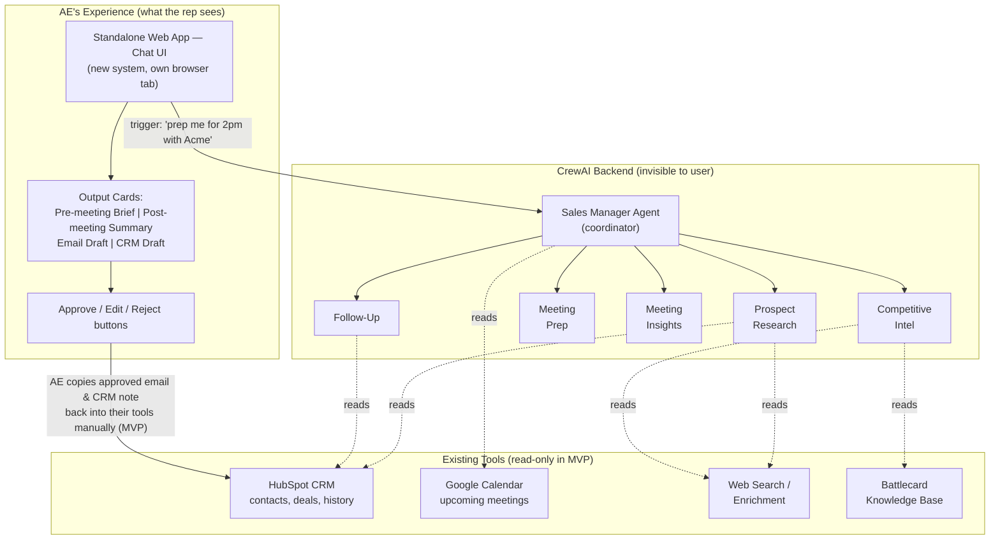
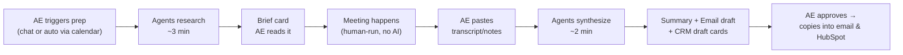

# Product Requirements Document (PRD)

## Document Info

| Field | Value |
|-------|-------|
| Product | Sales Enablement & Meeting Automation Crew |
| Use Case | Use Case 3 — Maven Agentic AI Architect Capstone (Lesson 4) |
| Version | 1.8 |
| Target CRM | HubSpot (synthetic data in MVP — see Decisions D9; live integration Phase 2) |
| Selected Runtime | `crewai` (`AAMAD_TARGET_RUNTIME=crewai`) |
| Input Artifacts | `mrd.md`, `MRD-v2.md` |
| Output Path | `project-context/1.define/PRD-2026-06-13.md` |
| Primary Persona | Mid-market B2B SaaS Account Executive |

---

## 1. Executive Summary

### Problem Statement (Research-backed)

B2B account executives spend **60–70% of their time on non-selling tasks**—research, CRM logging, meeting prep, and follow-up—leaving only **30–35% for active selling** (Salesforce State of Sales 2025/2026; Everstage). Reps lose an estimated **~2.5 hrs/week on prospect research** and **~6–8 hrs/week on CRM admin** alone (SyncGTM 2026).

Existing tools solve fragments of this problem (Gong for conversation intelligence, Outreach for engagement, Clari for forecasting) but remain **disconnected**. Organizations use **3+ enablement tools** on average (SiftHub), and **90% are adopting or planning GTM AI** (Highspot 2025)—yet buyers still lack a unified **prep → meeting → follow-up orchestration layer**.

**Target market:** Sales enablement platform market **USD 3.25–5.23B (2024)**, growing **~14–17% CAGR** to **USD 9–13B by 2030** (Grand View Research, Next MSC). Initial beachhead: **mid-market B2B SaaS teams (5–50 reps)**, North America first.

### Solution Overview (Evidence-based)

The **Sales Enablement & Meeting Automation Crew** is a CrewAI multi-agent system that coordinates specialized agents—Prospect Research, Competitive Intelligence, Meeting Prep, Meeting Insights, and Follow-Up—under a **Sales Manager coordinator agent**.

**Unique value proposition:** Orchestrates the full meeting lifecycle in one crew with shared context, rather than competing as another point solution.

#### Deployment Model: Standalone Application (Not a CRM Plugin)

The product ships as a **new, standalone web application** with a chat-first UI — it is **not** embedded inside HubSpot or Salesforce. Existing tools (CRM, calendar, web/enrichment, battlecard KB) are connected as **read-only data sources** in the MVP; the AE reviews and approves all outputs before anything reaches a customer or the CRM.

**Application overview:**



**Why standalone rather than CRM-native:**

1. **The workflow lives outside the CRM.** The meeting lifecycle spans calendar, web research, battlecards, notes, and email — reps avoid the CRM (that is the root problem this product addresses). A CRM-native agent places AI where reps don't work; the standalone app sits at the workflow's natural center: the meeting.
2. **Cross-tool orchestration is the differentiation.** The stated wedge — "orchestration layer, not another point solution" — only exists outside any single vendor's walls. CRM-native agents (e.g., Agentforce) are structurally biased toward their own platform's data and ecosystem.
3. **CRM-agnostic market position.** A standalone layer sells into HubSpot shops, Salesforce shops, and mixed stacks with one product, and avoids platform hostage risk (marketplace review cycles, revenue share, platform roadmap cloning the feature).
4. **Capstone/MVP velocity.** A standalone app demos the full P0 loop without CRM app-marketplace approval, with free choice of LLM provider and agent framework.
5. **Defensible asset.** Persistent cross-tool deal memory (P1) — what was researched, said, and promised across every meeting on a deal — cannot be built inside a single CRM's data model.

**Acknowledged trade-offs (and mitigations):**

| Risk of standalone | Mitigation |
|--------------------|------------|
| "Yet another tool" adoption fatigue | Calendar auto-trigger (FR-P0-08) pushes briefs to the rep; app comes to the user |
| Enterprise procurement friction (no enterprise SSO/SOC 2 in MVP) | **Google OAuth sign-in + allowlist provisioning (FR-P0-10, FR-P0-11)** for pilot teams; full enterprise SSO/SOC 2 in Phase 3 |
| Platform bundling of "good enough" native AI | Differentiate on cross-tool orchestration, custom battlecards, multi-CRM reach |
| New vendor data-trust concerns | Draft-only mode, read-only CRM, PII redaction, citations, audit logs (Section 5) |

**Strategic posture:** own the orchestration backend ("the brain"), stay flexible on the surface ("the face"). The crew runs as a headless backend behind an API; the chat web app is the first surface. Post-MVP, embedded surfaces (HubSpot sidebar widget, Slack bot) can be added without rebuilding the orchestration layer.

**Key differentiators vs. incumbents:**

| Incumbent | Strength | Gap this product fills |
|-----------|----------|------------------------|
| Gong | Conversation analytics | Weak cross-workflow prep orchestration |
| Outreach / Salesloft | Engagement sequences | Platform lock-in; less customizable agent roles |
| Salesforce Agentforce | CRM-native agents | Salesforce-ecosystem bound |
| Custom ChatGPT | Ad hoc assistance | No persistent deal context or structured handoffs |

**Expected outcomes — business KPIs per AE (post-pilot, research-backed targets):**

| KPI | Research benchmark | Product target (per AE, 12 mo) |
|-----|-------------------|-------------------------------|
| Revenue per AE | +41% ($1.75M vs $1.24M) — Optifai, N=938 | **+15–25%** (conservative vs. benchmark) |
| Deals closed per AE / quarter | +53% productivity → ~15→23 deals/mo — Optifai | **+10–20%** closed-won deals |
| Win rate | +25% (course); 42% more likely — Highspot | **+10–15%** absolute or relative improvement |
| Sales cycle / time to close | ↓28% cycle — Optifai; ↓32% — Salesforce | **↓15–25%** days to close |
| Quota attainment | Top performers 3.5× more proactive — Careertrainer | **+10%** reps at ≥100% quota |

**Expected outcomes — MVP leading indicators (capstone / 90-day pilot):**

- Prep time per meeting ↓ **80%+**
- Time-to-follow-up ↓ from **24–48 hrs → <1 hr**
- Meeting-to-next-step conversion ↑ **≥15%** (deals advancing within 7 days of meeting)
- CRM draft completeness ↑ **≥90%** required fields populated
- Rep-reported confidence before meetings ↑ (qualitative)

Leading indicators above are **proxies** for revenue and deal closure KPIs; pilot must measure both layers (see Section 7).

### Strategic Rationale

**Why multi-agent:** Sales workflows naturally decompose into specialist roles with handoffs (research → brief → summary → follow-up). A single monolithic agent cannot enforce least-privilege tools, parallel research, or human approval gates per step. CrewAI **hierarchical process**, **Flows**, and **shared memory** map directly to this domain (MRD-v2, `mrd.md` Dimension 2).

**Business case:** AI-augmented reps achieve **+41% revenue/rep** with **18% fewer activities** (Optifai, N=938); organizations using GTM AI report **+29% revenue growth** (Gong 2025). The product must ultimately move **revenue, deals closed, and win rate per AE**—not only efficiency metrics. MVP proves the workflow; pilot measures the revenue KPI cascade in Section 7.

**Market timing:** Buyer-side AI adoption (**94%** of B2B buyers use AI in buying — Forrester 2025) increases urgency for seller-side AI orchestration.

---

## 2. Market Context & User Analysis

### Target Market

| Segment | Characteristics | Size / Growth |
|---------|-----------------|---------------|
| Primary | Mid-market B2B SaaS AEs, 5–50 rep teams | Subset of USD 3.25–5.23B enablement TAM |
| Secondary | Sales managers, RevOps admins | Same org; buyer vs. user split |
| Geographic (MVP) | North America, English-only | Expand EU/APAC post-MVP (GDPR) |

### User Personas

**Persona 1: Alex — Account Executive (Primary)**
- Quota-carrying AE, 15–30 active opportunities
- Pain: prep inconsistency, delayed follow-ups, CRM backlog
- Goal: walk into meetings prepared; follow up same day
- Success: saves 5+ hrs/week on admin/research

**Persona 2: Jordan — Sales Manager**
- Manages 6–10 AEs
- Pain: poor CRM hygiene, late discovery of deal risks
- Goal: team consistency and forecast confidence
- Success: standardized briefs; visible next steps post-meeting

**Persona 3: Riley — RevOps Admin**
- Owns CRM config and tool stack
- Pain: tool sprawl, integration maintenance
- Goal: reliable data in CRM without rep burden
- Success: draft-then-approve CRM workflow; audit logs
- **MVP provisioning:** adds/removes reps via **CLI script or CSV upload** (FR-P0-11); no admin UI in MVP

### User Needs Analysis

**Critical pain points (MRD-v2 P0 jobs):**

| P0 # | Pain | Unmet need |
|------|------|------------|
| 1 | Manual meeting lookup | Auto-detect upcoming meetings |
| 2 | Scattered research | Single account/contact dossier |
| 3 | Stale battlecards | Fresh competitive talk tracks (verified) |
| 4 | Inconsistent prep | Structured pre-meeting brief |
| 5 | Delayed note-taking | Immediate post-meeting synthesis |
| 6 | Slow follow-up | Draft email within minutes |
| 7 | CRM neglect | Draft CRM update same session |

**User journey (MVP):**

```
Sign in (Google OAuth; email must be pre-provisioned)
  → Connect integrations in Settings (HubSpot, calendar — when enabled)
Trigger (manual or calendar)
  → Crew kickoff (Sales Manager delegates)
  → Research + Competitive Intel (parallel)
  → Meeting Prep brief
  → [Human: meeting occurs]
  → Transcript/notes input
  → Meeting Insights summary
  → Follow-Up: email draft + CRM draft
  → Human approval gates
  → (Optional) send/save
```

**Adoption barriers:** Trust in AI outputs, CRM write anxiety, competitive claim accuracy.  
**Success factors:** Human-in-the-loop, citations on research, draft-only CRM in MVP, visible time saved.

### Competitive Landscape

| Competitor | Pricing benchmark | MVP positioning |
|------------|-------------------|-----------------|
| Gong | ~$1,300–3,000/user/yr | Complement, not replace |
| Outreach | Enterprise engagement | Avoid head-on; focus prep/follow-up loop |
| HubSpot/SF native AI | Bundled in CRM | Orchestration layer across tools |

**Pricing hypothesis (post-capstone):** USD 49–149/user/month orchestration tier vs. USD 250+/user/month full CI platforms.

---

## 3. Technical Requirements & Architecture

### CrewAI Framework Specifications

**Process model:** `Process.hierarchical` with `manager_llm` (Sales Manager agent)

**Flow wrapper:** CrewAI Flows for deal-stage / meeting-type conditional routing (P1 enhancement)

**Memory:** Crew-level memory enabled for P1 #2; MVP may use in-session context only

**Orchestration pattern:**

```
Sales Manager (coordinator)
├── Prospect Research Agent    [P0 #2]
├── Competitive Intel Agent    [P0 #3]
├── Meeting Prep Agent         [P0 #4]
├── Meeting Insights Agent     [P0 #5]
└── Follow-Up Agent            [P0 #6, #7]
```

### Core Agent Definitions

#### sales_manager

- **role:** "Sales Operations Coordinator"
- **goal:** "Orchestrate specialist agents to deliver end-to-end meeting prep and follow-up workflows with accurate handoffs and human approval gates"
- **backstory:** "Senior sales ops leader who ensures every agent output is coherent, traceable, and ready for rep review before customer-facing use"
- **tools:** crew delegation only (no direct external writes)
- **memory:** true (P1)
- **delegation:** true — assigns tasks to specialist agents

#### prospect_research

- **role:** "Prospect & Account Research Analyst"
- **goal:** "Produce a consolidated account and contact dossier from CRM, web, and enrichment sources"
- **backstory:** "Former B2B research analyst skilled at synthesizing company news, org structure, and buyer context"
- **tools:** CRM read, web search, enrichment API (stub OK for MVP)
- **memory:** false (receives context from manager)
- **delegation:** false

#### competitive_intel

- **role:** "Competitive Intelligence Specialist"
- **goal:** "Identify likely competitors and produce positioning summaries with cited sources for rep approval"
- **backstory:** "Product marketing analyst focused on battlecards and win/loss patterns"
- **tools:** knowledge base RAG (battlecards), web search (limited)
- **memory:** false
- **delegation:** false

#### meeting_prep

- **role:** "Meeting Preparation Strategist"
- **goal:** "Generate a concise pre-meeting brief combining research, competitive context, CRM history, and recommended objectives"
- **backstory:** "Elite sales coach who prepares reps for high-stakes calls"
- **tools:** none (synthesizes upstream agent outputs)
- **memory:** false
- **delegation:** false

#### meeting_insights

- **role:** "Meeting Analysis Specialist"
- **goal:** "Extract decisions, action items, objections, and stakeholder mentions from meeting transcript or notes"
- **backstory:** "Conversation intelligence analyst trained on B2B sales calls"
- **tools:** transcript parser (text input MVP)
- **memory:** false
- **delegation:** false

#### follow_up

- **role:** "Follow-Up & CRM Documentation Agent"
- **goal:** "Draft follow-up email and CRM activity update for rep approval"
- **backstory:** "Sales assistant who ensures nothing falls through the cracks after meetings"
- **tools:** CRM read (draft write stub), email template generator
- **memory:** false
- **delegation:** false

### Integration Requirements

| System | MVP Scope | Priority |
|--------|-----------|----------|
| HubSpot CRM | **Synthetic/demo CRM data** for research and CRM draft cards; maps to HubSpot field schema | P0 (demo — see Decisions D9) |
| HubSpot CRM (live) | Per-user OAuth read contacts, deals, activities | **Phase 2** (customer pilot) |
| Google Calendar | Read upcoming meetings, attendees | P0 #1 (Sprint 3; primary — pairs with HubSpot/Google Workspace ICP) |
| MS Graph (Outlook calendar) | Read upcoming meetings, attendees | Phase 2 (with Microsoft OAuth — see D8) |
| Web search / enrichment | Account research | P0 #2 (stub acceptable Sprint 1) |
| Battlecard KB | Competitive intel RAG | P0 #3 |
| Gong / Chorus | Live CI | P2 — deferred |
| Email (SMTP/API) | Send after approval | Post-MVP |

**Authentication (two layers — do not conflate):**

| Layer | MVP mechanism | Notes |
|-------|---------------|-------|
| **App auth (reps)** | Google OAuth 2.0 + server session | FR-P0-10; user must be **pre-provisioned** (allowlist) |
| **User provisioning (admin)** | CLI script + CSV import | FR-P0-11; **no admin UI** in MVP |
| **Integration auth** | OAuth 2.0 per user for **Google Calendar** (Sprint 3); **HubSpot OAuth deferred to Phase 2** | Stored against user record; FR-P0-09 |
| **Backend secrets** | API keys via `.env` (see `.env.example`) | LLM provider, server signing keys |

**Performance targets (MVP):**

- Full prep workflow (P0 #2–4): **< 3 minutes** end-to-end
- Post-meeting package (P0 #5–7): **< 2 minutes** after transcript input
- Concurrent users (pilot org): **5–50** reps per deployment

### Infrastructure Specifications (MVP)

| Component | Specification |
|-----------|---------------|
| Cloud | Local dev + optional Docker; single-tenant pilot deploy |
| Compute | 1 backend instance; LLM via API |
| Storage | SQLite or PostgreSQL: **users, org, sessions, per-user settings, integration tokens**; workflow run history keyed by `user_id` |
| Logging | `project-context/2.build/logs` — redact secrets; log `user_id` on workflow and approval events |
| Monitoring | Structured agent trace logs; token/cost counters |

---

## 4. Functional Requirements

### P0 — Core Features (MVP)

Traceability: MRD-v2 P0 #1–7; usability requirements FR-P0-10, FR-P0-11

---

**FR-P0-01: Manual Meeting Workflow Trigger**

- **User story:** As an AE, I want to start a prep workflow by providing meeting context (account, attendees, datetime) so that I can get a brief without calendar integration on day one.
- **Acceptance criteria:**
  - Rep can submit meeting context via chat UI or API
  - System returns workflow run ID and status
  - Works without calendar connected (Sprint 1 default)
- **Dependencies:** Sales Manager agent, crew kickoff
- **MRD trace:** P0 #4 (Sprint 1); unblocks before P0 #1

---

**FR-P0-02: Prospect & Account Research**

- **User story:** As an AE, I want a consolidated account dossier so that I can understand the company and attendees before my meeting.
- **Acceptance criteria:**
  - Output includes: company summary, recent news, attendee roles, prior CRM interactions
  - Sources cited for external facts
  - Completes in < 90 seconds (mock enrichment OK)
  - **MVP uses synthetic HubSpot-style account/contact/deal fixtures** (Decision D9); live HubSpot read deferred to Phase 2
- **Agent:** prospect_research
- **MRD trace:** P0 #2

---

**FR-P0-03: Competitive Intelligence Brief**

- **User story:** As an AE, I want competitive positioning and talk tracks so that I can differentiate confidently in the meeting.
- **Acceptance criteria:**
  - Identifies 1–3 likely competitors
  - Provides strengths/weaknesses and suggested responses
  - Flags unverified claims for rep review
  - Requires explicit rep approval before inclusion in customer-facing follow-up
- **Agent:** competitive_intel
- **MRD trace:** P0 #3

---

**FR-P0-04: Pre-Meeting Brief Generation**

- **User story:** As an AE, I want a single pre-meeting brief so that I know who I'm meeting, what's at stake, and what to accomplish.
- **Acceptance criteria:**
  - Brief answers: who, company context, deal stage, stakeholders, competitors, meeting objectives, suggested questions
  - Combines FR-P0-02 and FR-P0-03 outputs
  - Formatted markdown or structured JSON for UI rendering
- **Agent:** meeting_prep
- **MRD trace:** P0 #4

---

**FR-P0-05: Post-Meeting Summary**

- **User story:** As an AE, I want meeting notes synthesized from a transcript or my notes so that I can act immediately after the call.
- **Acceptance criteria:**
  - Accepts pasted transcript or bullet notes (no Gong required)
  - Extracts: summary, decisions, action items, objections, stakeholders mentioned
  - Output structured for downstream follow-up agent
- **Agent:** meeting_insights
- **MRD trace:** P0 #5

---

**FR-P0-06: Follow-Up Email Draft**

- **User story:** As an AE, I want a draft follow-up email so that I can send it quickly while the conversation is fresh.
- **Acceptance criteria:**
  - Email reflects meeting summary content accurately
  - Rep must approve before send (send deferred in MVP; copy/export OK)
  - Includes clear next steps and proposed follow-up date
- **Agent:** follow_up
- **MRD trace:** P0 #6

---

**FR-P0-07: CRM Update Draft**

- **User story:** As an AE, I want a draft CRM activity log and field updates so that I can keep pipeline data accurate without manual entry.
- **Acceptance criteria:**
  - Draft includes: activity note, suggested next step, suggested close date/stage (if applicable)
  - **No auto-write to CRM in MVP** — display draft for copy or future approve-and-commit
  - Maps to HubSpot contact/deal IDs from **synthetic CRM fixtures in MVP**; live HubSpot ID mapping in Phase 2
- **Agent:** follow_up
- **MRD trace:** P0 #7

---

**FR-P0-08: Calendar-Triggered Prep (Sprint 3)**

- **User story:** As an AE, I want prep to start automatically when a meeting is on my calendar so that I don't have to manually trigger workflows.
- **Acceptance criteria:**
  - Reads calendar events within configurable window (default T-60 min)
  - Auto-starts FR-P0-02 through FR-P0-04 pipeline
  - Rep notified when brief is ready
  - Auto-trigger is **opt-in via Settings** (FR-P0-09); manual trigger remains the default and always available
- **MRD trace:** P0 #1

---

**FR-P0-09: User Settings Panel**

- **User story:** As an AE, I want a settings area in the chat app so that I can control how workflows are triggered and which tools are connected.
- **Acceptance criteria:**
  - **Trigger mode:** Manual (default) | Automatic via calendar — automatic selectable only once a calendar is connected (Sprint 3)
  - **Trigger window:** configurable lead time for auto-prep (default T-60 min)
  - **Integrations:** connect/disconnect **Google Calendar**; show connection status; HubSpot connect shown as **"Coming in Phase 2"** while MVP uses synthetic CRM data (D9)
  - Settings persist per authenticated user across sessions (FR-P0-10)
  - Sprint 1 scope: trigger mode shown with Automatic visible but disabled ("requires calendar connection") to set forward expectations
- **Dependencies:** FR-P0-10 (authenticated user), FR-P0-01 (manual default), FR-P0-08 (automatic mode)
- **MRD trace:** Supports P0 #1 rollout; UX requirement from Decisions D3

---

**FR-P0-10: Rep Sign-In & Session**

- **User story:** As an AE, I want to sign in to the web app with my work Google account so that my workflows, settings, and integrations are private to me.
- **Acceptance criteria:**
  - Unauthenticated users hitting the app are redirected to a **Sign in with Google** screen
  - On successful Google OAuth, system creates or resumes a **server-side session** (HTTP-only cookie or equivalent)
  - Sign-in succeeds **only if** the user's email exists in the provisioned user table with status `active` (allowlist — no public self-signup)
  - Non-provisioned or `inactive` users see a clear **"Access not enabled — contact your admin"** message (no account auto-creation)
  - Authenticated users can **sign out**; session invalidated server-side
  - **Session TTL: 24 hours** maximum lifetime from sign-in; expired sessions require re-authentication (Decision D7)
  - All workflow, settings, and approval APIs require a valid session; return **401** when absent or expired
  - Workflow runs, drafts, and approvals are **scoped to `user_id`** and not visible to other reps in the org
- **Dependencies:** FR-P0-11 (user must be provisioned before first login)
- **MRD trace:** Resolves MRD open question on multi-user pilot; prerequisite for FR-P0-09

---

**FR-P0-11: User Provisioning (Admin — Script & CSV, No UI)**

- **User story:** As a product admin (RevOps / internal operator), I want to add or remove sales users without an admin UI so that I can onboard a pilot team of ~10 AEs quickly.
- **Acceptance criteria:**
  - **CLI script** supports at minimum:
    - `add-user --email <email> --name "<display name>" [--role ae|admin]`
    - `deactivate-user --email <email>`
    - `list-users`
  - **CSV import** supports bulk onboarding with header row: `email,display_name,role,status` (`role` default `ae`; `status` default `active`)
  - Import is **idempotent**: re-importing the same email updates display name/role without duplicating rows
  - Script validates email format; rejects duplicate active emails
  - **No in-app admin UI** in MVP — provisioning is operator-only via script/CSV
  - **Single org per deployment** in MVP (`org_id` fixed or set via env); multi-tenant self-service signup deferred
  - Documented in setup artifact: example CSV, script usage, and rollback (deactivate user)
- **Dependencies:** None (must ship before or with FR-P0-10)
- **MRD trace:** Pilot readiness; supports 5–50 rep beachhead segment

---

### P1 — Enhanced Features

| ID | Feature | User story summary | MRD trace |
|----|---------|-------------------|-----------|
| FR-P1-01 | Personalized follow-up | Tailor email tone/content to account persona and prior interactions | P1 #1 |
| FR-P1-02 | Shared deal memory | Persist account context across meetings on same deal | P1 #2 |
| FR-P1-03 | Deal risk alerts | Flag missing stakeholders, stale deals, objection patterns | P1 #3 |
| FR-P1-04 | Lead/deal scoring | Rank opportunities for daily focus | P1 #4 |
| FR-P1-05 | Deal-stage Flow routing | Route agent tasks by discovery/demo/negotiation stage | Phase C |

### P2 — Future Features (Out of Scope — Capstone)

| ID | Feature | Reason deferred | MRD trace |
|----|---------|-----------------|-----------|
| FR-P2-01 | Live in-meeting coaching | Requires streaming CI integration | P2 #1 |
| FR-P2-02 | Autonomous outbound SDR | Different product surface | P2 #2 |

---

## 5. Non-Functional Requirements

### Performance

| Requirement | Target |
|-------------|--------|
| Prep workflow latency | < 3 min P95 |
| Post-meeting package latency | < 2 min P95 |
| API availability (demo) | 99% during demo windows |

### Security & Compliance

| Requirement | MVP implementation |
|-------------|-------------------|
| App authentication | Google OAuth + allowlist (FR-P0-10); no public signup |
| User provisioning | CLI + CSV only (FR-P0-11); no admin UI |
| Session security | HTTP-only session cookie; server-side session store; **24-hour session TTL** (D7); CSRF protection on mutating routes |
| Secrets management | Environment variables only; `.env.example` documented |
| PII in logs | Redact emails, phone numbers in trace logs |
| CRM access | Read + draft from **synthetic HubSpot fixtures in MVP** (D9); live per-user HubSpot OAuth Phase 2; no silent writes |
| Competitive claims | Human approval gate; approval attributed to `user_id` |
| GDPR / SOC 2 | Document deferrals; enterprise SSO deferred to Phase 3 |

### Scalability & Reliability

| Requirement | MVP | Production target |
|-------------|-----|-------------------|
| Concurrent crews | 5–50 (single pilot org) | 50+ multi-tenant (Phase 3) |
| Retry on LLM failure | 2 retries with backoff | Required |
| Idempotency | Same meeting ID → same workflow key | Required for calendar trigger |

---

## 6. User Experience Design

### Interface Requirements (MVP)

- **Sign-in screen (FR-P0-10):** Google OAuth button; error state for non-provisioned users; sign-out in app header
- **Chat-first UI** (AAMAD standard): single interface to trigger workflows and view agent outputs
- **Structured output cards:** Pre-meeting brief | Post-meeting summary | Email draft | CRM draft
- **Approval buttons:** Approve / Edit / Reject for competitive claims, email, CRM draft
- **Status indicator:** Workflow progress (researching → briefing → ready)
- **Settings panel (FR-P0-09):** trigger mode (manual default / automatic via calendar), trigger window, integration connections and status
- **Mobile:** Not required for capstone MVP

### Agent Interaction Design

| Pattern | Implementation |
|---------|----------------|
| Transparency | Show which agent produced each section |
| Explainability | Citations on research and competitive claims |
| Error handling | Graceful fallback if enrichment API unavailable |
| Human-in-the-loop | Mandatory approval before customer-facing or CRM commit actions |

### Application Diagram Overview

See **Section 1 → Solution Overview → Deployment Model** for the full application overview diagram (standalone chat app + CrewAI backend + read-only tool integrations) and the standalone-vs-CRM-native rationale.

**Meeting lifecycle flow (single meeting):**



Traceability: UI elements map to Section 6 Interface Requirements; agent topology maps to Section 3 Orchestration Pattern; read-only integration boundary maps to FR-P0-07 and Section 5 Security (no silent CRM writes).

---

## 7. Success Metrics & KPIs

### Revenue & Deal Outcomes per AE (Primary Business KPIs)

These are the **north-star business metrics** the product must influence. Targets are per quota-carrying AE unless noted as team-level.

| KPI | Definition | Research benchmark | 90-day pilot target | 12-month target (per AE) |
|-----|------------|-------------------|---------------------|--------------------------|
| **Revenue per AE** | Closed-won revenue attributed to AE | +41% ($1.75M vs $1.24M) — Optifai, N=938 | **+5–10%** vs. pre-pilot baseline | **+15–25%** |
| **Deals closed per AE** | Count of closed-won opportunities per quarter | ~15→23 deals/mo with AI (+53% productivity) — Optifai | **+5–10%** deals closed | **+10–20%** deals closed |
| **Win rate** | Closed-won ÷ (closed-won + closed-lost) | +25% improvement (course); 42% more likely — Highspot | **+5%** absolute improvement | **+10–15%** relative improvement |
| **Sales cycle length** | Days from opportunity create → closed-won | ↓28% — Optifai; ↓32% — Salesforce; ↓45 days enterprise (course, segment-dependent) | **↓10%** median days to close | **↓15–25%** median days to close |
| **Deal velocity** | (Opportunities × avg deal size × win rate) ÷ cycle days | B2B SaaS median ~$8,200/day pipeline velocity — Optifai | **+10%** velocity | **+20–28%** velocity |
| **Average deal size** | Mean closed-won ACV | +50% avg deal ($72K vs $48K) — Optifai AI-augmented | Hold or **+5%** | **+10–15%** |
| **Quota attainment** | % of AE at ≥100% quota | Mature enablement 4:1 ROI — SiftHub | **+10%** of team at quota | **+15–20%** of team at quota |
| **Team revenue growth** | Org-level GTM revenue YoY | +29% vs peers — Gong 2025 | Directionally positive | **+10–20%** (team, with attribution controls) |

**Measurement requirements:**

- Establish **90-day pre-pilot baseline** per AE: revenue, deals closed, win rate, avg cycle days, pipeline velocity
- Use **control group or staggered rollout** where possible (5–10 AEs treatment vs. matched cohort)
- Attribute revenue to crew usage via CRM: meetings prepped/followed-up through system vs. not
- Report KPIs **monthly per AE** and rolled up at team level for CRO/RevOps review

### KPI Cascade (Leading → Lagging)

```
Efficiency (MVP)                    Deal motion (Pilot)              Revenue (12 mo)
─────────────────                   ───────────────────              ────────────────
Prep time ↓ 80%          ──►        Meeting→next step ↑ 15%  ──►   Deals closed/AE ↑ 10–20%
Follow-up < 1 hr         ──►        Win rate ↑ 5–10%       ──►   Win rate ↑ 10–15%
CRM completeness ↑ 90%   ──►        Cycle days ↓ 10–25%    ──►   Revenue/AE ↑ 15–25%
Selling time reinvested  ──►        Pipeline velocity ↑    ──►   Quota attainment ↑
```

### Business Metrics (Leading — MVP / 90-Day Pilot)

| Metric | Target | Measurement | Links to revenue KPI |
|--------|--------|-------------|----------------------|
| Prep time per meeting | ↓ 80% vs. manual baseline | Workflow timestamps + self-report | More meetings run well → win rate ↑ |
| Time to follow-up draft | < 15 min post-meeting | Workflow timestamps | Faster follow-up → deal velocity ↑ |
| Meeting-to-next-step conversion | ↑ ≥ 15% within 7 days | CRM stage change after crew-tagged meeting | Deals advance → closure rate ↑ |
| Brief completeness score | ≥ 90% required fields | Schema validation | Better prep → win rate ↑ |
| Rep approval rate of drafts | ≥ 70% approved with minor edits | Approval UI events | Adoption → KPI cascade activates |
| Selling time reinvested | ↑ ≥ 5 hrs/week per AE | Time study or self-report | Capacity for more deals → deals closed ↑ |

### Business Metrics (Lagging — Pilot & Production)

| Metric | Pilot target (90 days) | 12-month target | Benchmark source |
|--------|------------------------|-----------------|------------------|
| Revenue per AE | +5–10% | +15–25% | Optifai +41%; Gong +29% org growth |
| Deals closed per AE | +5–10% | +10–20% | Optifai 15→23 deals/mo |
| Win rate | +5% absolute | +10–15% relative | Highspot 42% more likely |
| Sales cycle reduction | ↓10% | ↓15–25% | Optifai 28%; Salesforce 32% |
| Deal velocity | +10% | +20–28% | Optifai pipeline velocity data |
| ROI on enablement spend | Break-even path documented | **4:1** enablement ROI | SiftHub mature programs |

**Honest attribution note (from `mrd.md`):** Only ~5% of enterprises reliably measure AI ROI today (IBM, 2026). This product must instrument the KPI cascade above from day one of pilot—not rely on efficiency metrics alone.

### Technical Metrics

| Metric | Target |
|--------|--------|
| Agent task success rate | ≥ 95% without unrecoverable error |
| Hallucination flag rate (competitive) | 100% unverified claims flagged |
| Cost per workflow run | < USD 2.00 (MVP budget) |

### User Experience Metrics

| Metric | Target |
|--------|--------|
| Task completion rate | ≥ 90% of started workflows complete |
| Rep trust score (survey) | ≥ 4/5 after 2 weeks |
| Time-to-first-brief (onboarding) | < 10 min including sign-in and connect |
| Provisioning time (10 users) | < 15 min via CSV import (FR-P0-11) |

---

## 8. Implementation Strategy

### Development Phases (Aligned to MRD-v2 Sprints)

**Phase 1 — MVP Core (Sprints 1–3)**

| Sprint | Scope | FR IDs |
|--------|-------|--------|
| 1 | **Auth + provisioning**, prep → follow-up loop with mock data | FR-P0-10, 11, 01, 04, 05, 06, 07, 09 |
| 2 | Live research + competitive intel | FR-P0-02, 03 |
| 3 | Calendar auto-trigger + per-user **Google Calendar** OAuth | FR-P0-08 |

Deliverables: CrewAI crew (`config/agents.yaml`, `config/tasks.yaml`, `crew.py`), chat API, sign-in + chat UI, provisioning script/CSV, **synthetic HubSpot fixture dataset**

**Phase 2 — Enhanced + Customer Integrations (Sprints 4–6)**

| Sprint | Scope | FR IDs |
|--------|-------|--------|
| 4 | **Live HubSpot OAuth** (replaces synthetic CRM) + **Microsoft OAuth sign-in** (D8) | FR-P0-09 (HubSpot connect), platform auth |
| 5 | Personalized follow-up + memory + deal alerts | FR-P1-01, 02, 03 |
| 6 | Lead scoring | FR-P1-04, 05 |

**Phase 3 — Scale (Post-capstone)**

- CRM approve-and-commit writes
- Gong integration
- Admin UI for user/org management
- Enterprise SSO (Okta/Azure AD), SOC 2 path
- FR-P2-* evaluation

### Resource Requirements

| Role | Capstone need |
|------|---------------|
| Backend engineer | CrewAI crew, API, integrations |
| Frontend engineer | Chat UI, approval flows |
| Integration engineer | CRM + calendar wiring |
| QA | End-to-end workflow validation |

**Budget (API costs):** USD 500–2,000 for capstone development and demos

### Risk Mitigation

| Risk | Mitigation |
|------|------------|
| Hallucinated competitive claims | RAG + approval gate + citations |
| CRM data quality | Validate required fields; enrichment fallback |
| Scope creep | Strict P0-only for capstone demo sign-off |
| LLM cost overrun | Token budgets per workflow; caching research |
| Low rep trust | Draft-only mode; transparent agent attribution |
| Unauthorized access / shared anonymous state | FR-P0-10 allowlist + session-scoped data; FR-P0-11 provisioning audit |

---

## 9. Launch & Go-to-Market Strategy

### Beta Testing Plan (Post-capstone path)

- **Segment:** 3–5 mid-market SaaS teams with HubSpot + Google Calendar
- **Duration:** 90 days (minimum for revenue KPI measurement)
- **Success — leading:** ≥ 70% weekly active reps; prep time ↓ 80%; follow-up < 1 hr
- **Success — business (per AE):** Revenue +5–10%; deals closed +5–10%; win rate +5%; cycle ↓10%
- **Feedback:** Weekly rep interviews + monthly KPI dashboard for RevOps/CRO

### Market Launch Strategy

- **Beachhead:** B2B SaaS AEs already on HubSpot
- **Channel:** Product-led demo → RevOps buyer conversation
- **Pricing hypothesis:** USD 79/user/month orchestration tier
- **Message:** "Your sales crew prepares, summarizes, and follows up—so you sell."

### Launch Success Criteria

| Milestone | Criteria |
|-----------|----------|
| Capstone demo | Full P0 loop live in ≤ 6 weeks |
| Beta (90 days) | 3 design partners; per-AE KPI baseline + **+5% revenue or deals closed** measured |
| GA readiness | CRM write with approval; SOC 2 roadmap; **12-month KPI targets** instrumented in product analytics |

---

## Requirements Traceability Matrix

| MRD-v2 Ref | PRD FR | Agent |
|------------|--------|-------|
| Pilot usability (MRD open Q8) | FR-P0-10, FR-P0-11 | Platform (auth + provisioning) |
| P0 #1 | FR-P0-08 | Calendar + Sales Manager |
| P0 #2 | FR-P0-02 | prospect_research |
| P0 #3 | FR-P0-03 | competitive_intel |
| P0 #4 | FR-P0-04 | meeting_prep |
| P0 #5 | FR-P0-05 | meeting_insights |
| P0 #6 | FR-P0-06 | follow_up |
| P0 #7 | FR-P0-07 | follow_up |
| P1 #1 | FR-P1-01 | follow_up / content |
| P1 #2 | FR-P1-02 | sales_manager |
| P1 #3 | FR-P1-03 | deal_progression (new P1 agent) |
| P1 #4 | FR-P1-04 | lead_scoring (new P1 agent) |
| P2 #1 | FR-P2-01 | meeting_insights (live) |
| P2 #2 | FR-P2-02 | outbound (new P2 agent) |

---

## Quality Assurance Checklist

- [x] All requirements traceable to `MRD-v2.md` and `mrd.md`
- [x] Technical specifications feasible with CrewAI hierarchical + Flows
- [x] Success metrics aligned with business objectives (leading indicators for MVP)
- [x] MVP includes rep authentication and operator provisioning (FR-P0-10, FR-P0-11)
- [x] Resource requirements scoped for capstone
- [x] Risk mitigation documented
- [x] Timeline aligned to MRD-v2 sprint plan (6 sprints)

---

## Sources

1. `project-context/1.define/MRD-v2.md` — JTBD priorities and phasing (primary input)
2. `project-context/1.define/mrd.md` — quantitative market research
3. Grand View Research, Next MSC — sales enablement market sizing
4. Gong — State of Revenue Growth 2025
5. Highspot — State of Sales Enablement 2025
6. Salesforce — State of Sales 2025/2026
7. SyncGTM — sales task time benchmarks, 2026
8. Forrester — B2B buyer AI adoption, 2025
9. Optifai — AI-augmented sales productivity benchmark, N=938
10. CrewAI documentation — hierarchical process, Flows, memory
11. Maven Capstone Use Case Brief — Use Case 3, Lesson 4

---

## Decisions

**D1 — HubSpot is the primary CRM and initial target user base (confirmed 2026-06-09).**

- **Decision:** Build the MVP and go-to-market exclusively against HubSpot. Salesforce is a documented Phase 3 port (keep the CRM adapter interface clean; spend zero capstone effort on SF).
- **Rationale:**
  - HubSpot's center of gravity is mid-market B2B SaaS (5–50 rep teams) — exact match to the PRD's primary segment.
  - Lighter procurement (founder/VP-Sales-led buying vs. enterprise security committees); a draft-only, read-only tool can be adopted without a long security cycle.
  - HubSpot's native AI (Breeze) is materially behind Salesforce Agentforce in agentic depth — longer competitive window before "good enough native" bundling.
  - Simpler API surface and lighter marketplace listing process than AppExchange for the post-MVP embedded surface.
- **Cascading implications:**
  - CRM draft card (FR-P0-07) outputs fields mapping 1:1 to HubSpot properties (deal stage, next step, close date).
  - CRM tool layer built against HubSpot object model: Contacts, Companies, Deals, Engagements/Notes.
  - Distribution channel: HubSpot user communities, agency partners, and eventually a HubSpot App Marketplace listing.

**D2 — Google Calendar is the primary calendar integration (follows from D1).**

- HubSpot mid-market predominantly runs Google Workspace; FR-P0-08 targets Google Calendar. MS Graph/Outlook deferred to post-MVP.

**D3 — Manual trigger confirmed for Sprint 1; trigger mode becomes a user setting (confirmed 2026-06-09).**

- **Decision:** Sprint 1 demo acceptance uses the manual trigger (FR-P0-01) — rep supplies meeting context via chat. Calendar auto-trigger (FR-P0-08) arrives in Sprint 3 as an **opt-in setting**, not a forced behavior change.
- **Rationale:** Zero integration/OAuth work needed for the first working demo; the core value loop (brief → summary → email + CRM drafts) is provable with typed input and mock data.
- **Cascading implication:** The chat app requires a **Settings panel (FR-P0-09)** from Sprint 1 — trigger mode (manual default / automatic), trigger window, and integration connection management — so the manual→automatic transition is a user choice, not a redeploy.

**D4 — Web app for MVP and pilot; native desktop deferred (confirmed 2026-06-09).**

- **Decision:** The MVP and 90-day pilot ship as a **browser-based web app**. A native Mac/Windows desktop app was considered and deferred.
- **Rationale:**
  - Native packaging (two OS targets, code signing/notarization, installers, auto-update) roughly doubles ship cost with zero workflow value for a 6-week capstone.
  - Web app minimizes pilot friction: reps onboard via a URL; desktop installers risk IT/MDM blockers at pilot companies.
  - Continuous deployment during pilot — all users always on the latest version while iterating on feedback.
  - Rep workflow (HubSpot, Gmail, LinkedIn) is browser-based; the app sits beside the tools reps copy outputs into.
- **Desktop-presence mitigations in the web app:** browser push notifications and/or Slack notification for "brief ready" (supports the FR-P0-08 auto-trigger moment).
- **Demand gate for revisit:** if ≥2 pilot teams request desktop presence, ship a Tauri/Electron wrapper around the same web app (the headless crew backend and API are surface-agnostic, so no orchestration rework).

**D5 — Lightweight app authentication is P0 for a usable MVP (confirmed 2026-06-13).**

- **Decision:** The MVP **requires rep sign-in** (FR-P0-10) and **operator-driven user provisioning** via CLI/CSV (FR-P0-11). Integration OAuth alone is insufficient.
- **Rationale:**
  - FR-P0-09 (per-user settings), per-user HubSpot/calendar tokens, and approval attribution all require a stable **user identity**.
  - A shared URL with no login is not shippable to a pilot org of 5–50 AEs — reps would share state, settings, and drafts.
  - Google OAuth matches the HubSpot + Google Workspace ICP (D1, D2) with minimal UX friction.
- **Explicitly out of MVP scope:** admin UI for user management, public self-signup, enterprise SSO (Okta/Azure AD), password/email auth as primary path, multi-tenant billing.
- **Cascading implications:**
  - Sprint 1 must deliver auth before or alongside the chat workflow loop.
  - RevOps/admin (Persona 3) onboards reps by running the provisioning script — document in `setup.md`.
  - Phase 3 adds enterprise SSO and in-app admin; MVP provisioning path must not block that migration (store `external_id` from Google; reserve `sso_provider` field nullable).

**D6 — Allowlist provisioning, not open registration (confirmed 2026-06-13).**

- **Decision:** Users are **invited by provision** only. First Google sign-in activates a pre-created row; unknown emails are rejected.
- **Rationale:** Pilot control, no spam accounts, simpler security review for first org.
- **Operator workflow (10-rep org example):**
  1. Deploy app for customer org (single `org_id`).
  2. RevOps runs CSV import with 10 AE emails.
  3. Reps receive app URL; each signs in with Google using their provisioned work email.
  4. Rep connects **Google Calendar** in Settings when auto-prep is desired (FR-P0-09); **live HubSpot connect available in Phase 2** (D9).
- **CSV example:**

```csv
email,display_name,role,status
alex@acme.com,Alex Chen,ae,active
jordan@acme.com,Jordan Lee,ae,active
riley@acme.com,Riley Morgan,admin,active
```

**D7 — Session TTL is 24 hours (confirmed 2026-06-13).**

- **Decision:** Authenticated sessions expire **24 hours after sign-in**; users must re-authenticate via Google OAuth.
- **Rationale:** Balances pilot security with reasonable daily reuse; avoids long-lived sessions without enterprise SSO controls.
- **Implementation note:** Store `session_expires_at`; return 401 on expiry; optional friendly re-login prompt in UI.

**D8 — Microsoft OAuth sign-in in Phase 2 (confirmed 2026-06-13).**

- **Decision:** MVP sign-in is **Google OAuth only** (FR-P0-10). **Microsoft OAuth** (Azure AD / Entra ID) for rep sign-in ships in **Phase 2, Sprint 4** alongside live HubSpot integration.
- **Rationale:** Google matches primary ICP; Microsoft-only orgs are supported before Phase 3 enterprise SSO.
- **Cascading implications:** Reserve `auth_provider` field on user record (`google` | `microsoft`); MS Graph calendar integration aligns with Phase 2 Microsoft auth.

**D9 — Synthetic HubSpot data for MVP demo; live HubSpot in Phase 2 (confirmed 2026-06-13).**

- **Decision:** MVP and capstone demo use a **curated synthetic HubSpot-style dataset** (accounts, contacts, deals, activities) for research inputs and CRM draft outputs. **Live HubSpot OAuth read integration** ships in **Phase 2, Sprint 4** when onboarding paying pilot customers.
- **Rationale:** Faster demo reliability, no sandbox credentials required for first build; CRM draft schema still validated against HubSpot field model (D1).
- **Cascading implications:**
  - FR-P0-02, FR-P0-07 read from synthetic fixtures in MVP.
  - Settings panel shows HubSpot as **Phase 2** until live connect ships.
  - CRM adapter interface must support swapping synthetic provider → live HubSpot without agent rework.

---

## Assumptions

1. **Runtime:** `AAMAD_TARGET_RUNTIME=crewai` for all implementation epics.
2. **CRM data (MVP):** Synthetic HubSpot-style fixtures for demo and MVP workflows (Decision D9); live HubSpot OAuth in Phase 2; Salesforce deferred to Phase 3.
3. **Sprint 1 trigger:** Manual meeting input acceptable before calendar integration (FR-P0-01 before FR-P0-08).
4. **Transcript input:** Pasted text or mock transcript for FR-P0-05; no Gong in MVP.
5. **CRM writes:** Draft-only through capstone demo; approve-and-commit is post-MVP.
6. **Content Personalization (P1 #1):** Merged into Follow-Up agent unless scope allows separate agent.
7. **English only** for MVP UI and agent outputs.
8. **Auth provider (MVP):** Google OAuth only (FR-P0-10); Microsoft OAuth sign-in in Phase 2 (D8); enterprise SSO in Phase 3.
9. **Session TTL:** 24 hours from sign-in (D7).
10. **First pilot org:** single-tenant deployment with one `org_id`; all 5–50 reps provisioned via CSV before go-live.

---

## Open Questions

1. ~~Confirm HubSpot vs. Salesforce as primary CRM for capstone build.~~ **Resolved — see Decisions D1 (HubSpot confirmed).**
2. ~~Confirm manual trigger sufficient for Sprint 1 demo acceptance.~~ **Resolved — see Decisions D3 (manual trigger confirmed; trigger mode exposed as user setting via FR-P0-09).**
3. ~~Does MVP require multi-user auth for pilot usability?~~ **Resolved — see Decisions D5, D6; FR-P0-10, FR-P0-11.**
4. Minimum HubSpot fields for CRM draft schema (deal stage, next step, close date — confirm with stakeholder).
5. ~~Should pilot use synthetic account data exclusively, or connect to live HubSpot sandbox per user?~~ **Resolved — see Decision D9 (synthetic HubSpot in MVP; live integration Phase 2).**
6. LLM provider preference (OpenAI vs. Anthropic) for `manager_llm` and specialist agents?
7. ~~Session TTL default (e.g., 7-day rolling vs. 24-hour)?~~ **Resolved — see Decision D7 (24-hour session TTL).**
8. ~~Microsoft-only identity for pilot orgs?~~ **Resolved — see Decision D8 (Microsoft OAuth sign-in in Phase 2).**

---

## Audit

| Field | Value |
|-------|-------|
| Timestamp | 2026-06-13T12:00:00-05:00 |
| Persona | @product-mgr |
| Action | create-prd → … → update-v1.7-lightweight-auth-fr → update-v1.8-session-ttl-microsoft-phase2-synthetic-crm → rename PRD-2026-06-13 |
| Template | `.cursor/templates/prd-template.md` |
| Input | `project-context/1.define/MRD-v2.md`, `mrd.md` |
| Output Path | `project-context/1.define/PRD-2026-06-13.md` |
| Runtime | crewai |
| Model | Claude (Cursor Agent) |
| Temperature | Low (deterministic artifact generation) |
| Traceability | MRD-v2 → PRD → pending SAD (@system.arch) |
| Prompt Trace | Omitted — PRD generated from approved define artifacts; no production runtime prompts |
