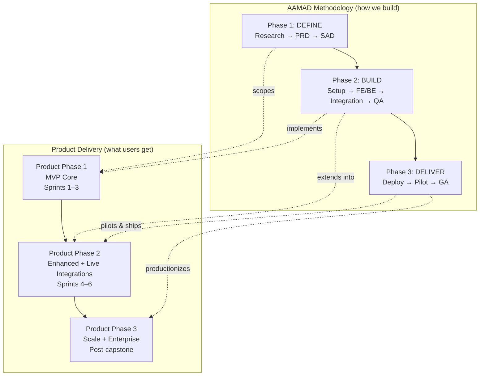
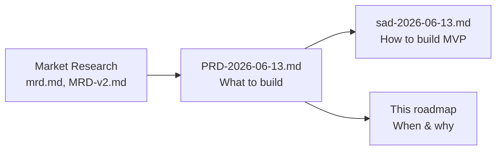
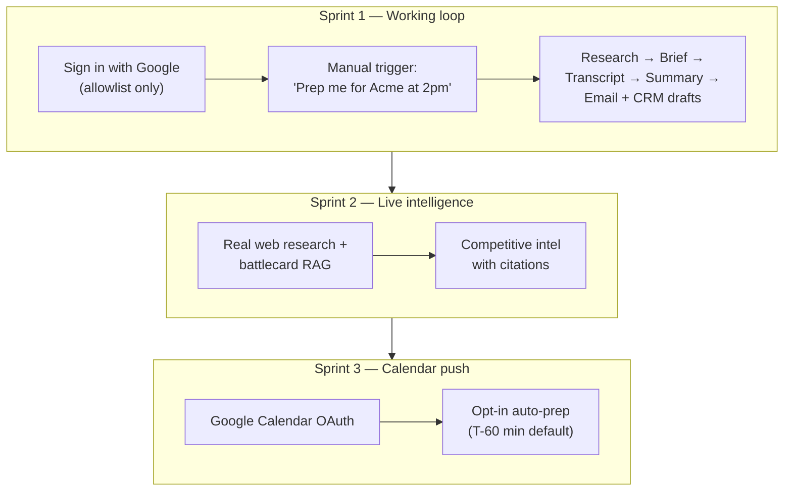
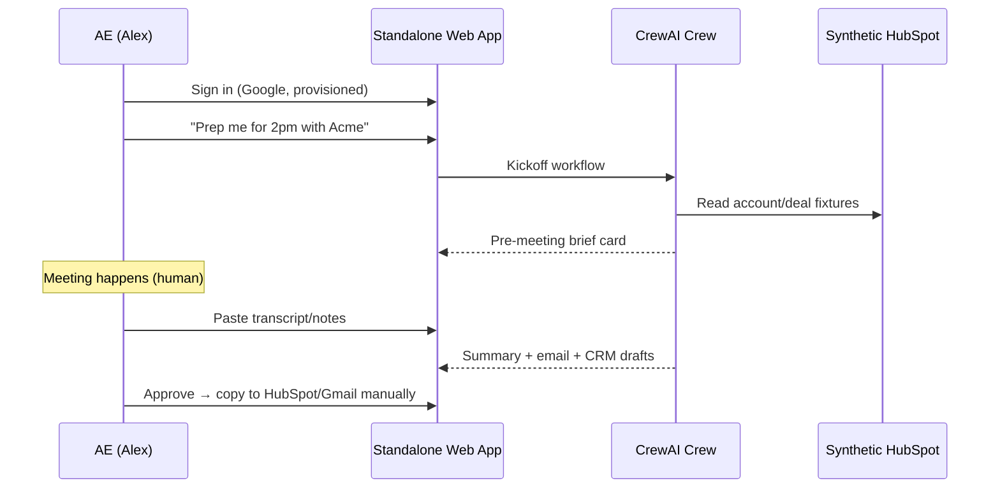
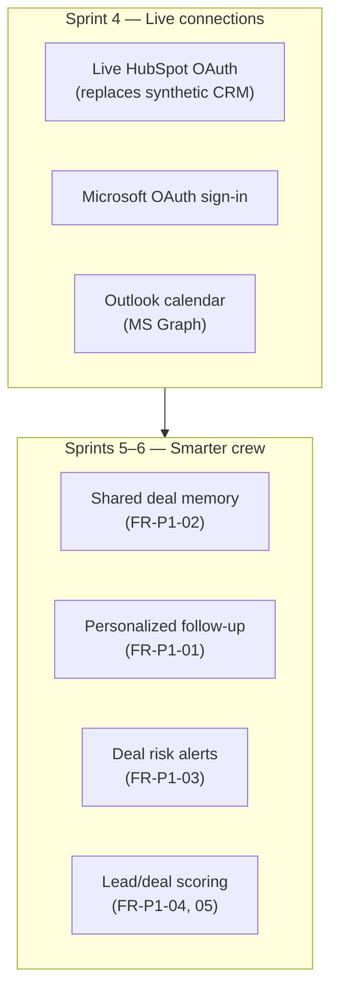
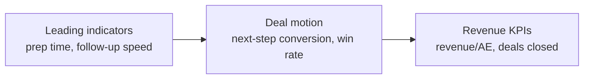
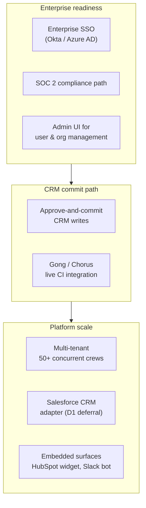
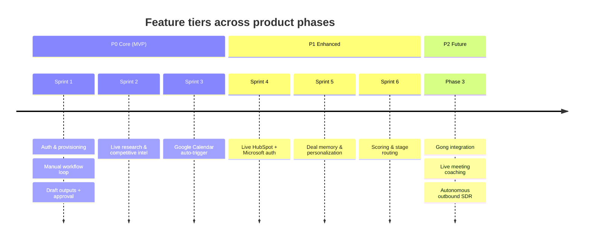
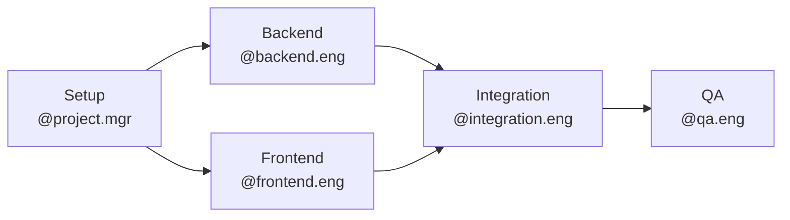
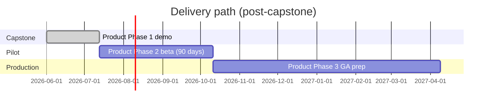

# Product Roadmap Document

## Document Info

| Field | Value |
|-------|-------|
| Product | Sales Enablement & Meeting Automation Crew |
| Version | 1.0 |
| Input Artifacts | `PRD-2026-06-13.md` (v1.9), `sad-2026-06-13.md`, `MRD-v2.md` |
| Output Path | `project-context/1.define/product-roadmap-document.md` |
| Author | @product-mgr |
| Purpose | Help readers visualize **what exists at each phase** — AAMAD methodology phases and product delivery phases |

---

## How to Read This Document

This product uses **two overlapping "phase" concepts**. They are related but not the same:

| Concept | What it means | Where it lives |
|---------|---------------|----------------|
| **AAMAD phases** | How the *project team* works — Define → Build → Deliver | `AGENTS.md`, AAMAD framework |
| **Product phases** | What the *product* ships — MVP Core → Enhanced → Scale | PRD §8, MRD-v2 sprints |

The roadmap below maps both so stakeholders, engineers, and reviewers can answer: *"Where are we, what can users do, and what comes next?"*

---

## At a Glance: What Users Can Do by Phase

| Phase | Timeline (indicative) | User-facing headline | Primary persona |
|-------|----------------------|----------------------|-----------------|
| **AAMAD Define** | Complete | Requirements locked; no product yet | @product-mgr, @system.arch |
| **Product Phase 1 — MVP Core** | Sprints 1–3 (~6 weeks capstone) | *"Prep, summarize, and follow up — with human approval"* | Alex (AE) |
| **Product Phase 2 — Enhanced** | Sprints 4–6 + 90-day pilot | *"Your real CRM, smarter follow-ups, deal memory"* | Alex, Jordan (Sales Manager) |
| **Product Phase 3 — Scale** | Post-capstone / GA path | *"Enterprise-ready orchestration layer"* | Riley (RevOps), enterprise buyers |
| **AAMAD Deliver** | Overlaps Phase 2–3 | Deployed, measured, iterated | DevOps, RevOps, CRO |

---

## AAMAD Phase 1 — DEFINE (Complete)

**Status:** ✅ Complete — artifacts ready for build handoff.

**Goal:** Capture market context, requirements, and architecture so build personas can execute without inventing scope.

### What exists at this phase

Nothing runnable for end users. Instead, the team produces **auditable context artifacts**:

### Key outputs

| Artifact | Owner | Contents |
|----------|-------|----------|
| MRD / MRD-v2 | @product-mgr | Jobs-to-be-done, P0/P1/P2 priorities, sprint phasing |
| PRD | @product-mgr | Functional requirements (FR-P0-*), KPIs, decisions D1–D11 |
| SAD | @system.arch | MVP architecture, agent topology, deferred work |
| Product Roadmap | @product-mgr | This document — phase visualization |

### Decisions locked for downstream build

- Standalone web app (not CRM plugin)
- CrewAI hierarchical crew, Anthropic Claude (D11)
- Synthetic HubSpot data in MVP; live HubSpot in Product Phase 2 (D9)
- Google OAuth + allowlist provisioning (D5, D6)
- Draft-only CRM — no silent writes through capstone

### Success criteria (Define)

- [x] All PRD open questions resolved
- [x] P0 requirements traceable to MRD-v2
- [x] SAD scoped to MVP (Sprints 1–3) with explicit deferrals

---

## Product Phase 1 — MVP Core (Sprints 1–3)

**AAMAD mapping:** Executed during **AAMAD Build (Phase 2)** — epics: Setup, Backend, Frontend, Integration, QA.

**Goal:** Prove the full meeting lifecycle loop with a demo-ready capstone: prep → meeting → follow-up, with human approval gates.

### Visual: MVP user experience

### Sprint breakdown

| Sprint | Scope | FR IDs | What Alex (AE) experiences |
|--------|-------|--------|----------------------------|
| **1** | Auth, provisioning, end-to-end loop with mock/synthetic data | FR-P0-10, 11, 01, 04, 05, 06, 07, 09 | Signs in → triggers prep manually → gets brief → pastes notes → gets summary, email draft, CRM draft → approves/edits/rejects |
| **2** | Live research + competitive intel | FR-P0-02, 03 | Brief includes cited account dossier and verified competitive talk tracks |
| **3** | Calendar auto-trigger | FR-P0-08 | Connects Google Calendar in Settings → optional auto-prep before meetings |

### What is **in** Product Phase 1

| Category | Included |
|----------|----------|
| **Agents** | Sales Manager + 5 specialists (research, competitive, prep, insights, follow-up) |
| **UI** | Chat-first web app, output cards, approval buttons, settings panel |
| **Auth** | Google OAuth, 24h session, CLI/CSV user provisioning (no admin UI) |
| **CRM** | Synthetic HubSpot-style fixtures; draft cards map to HubSpot fields (D10) |
| **Calendar** | Google Calendar read + opt-in auto-trigger (Sprint 3) |
| **Integrations** | Web search (stub → live), battlecard KB RAG |
| **Security** | Allowlist, draft-only CRM, PII redaction in logs, human approval gates |

### What is **not** in Product Phase 1 (explicit deferrals)

| Deferred item | Target phase |
|---------------|--------------|
| Live HubSpot OAuth read | Product Phase 2 (Sprint 4) |
| Microsoft OAuth sign-in | Product Phase 2 (Sprint 4) |
| CRM approve-and-commit writes | Product Phase 3 |
| Shared deal memory across meetings | Product Phase 2 (Sprint 5) |
| Enterprise SSO / SOC 2 | Product Phase 3 |
| Email send after approval | Post-MVP |
| Gong / live conversation intelligence | Product Phase 3+ (P2) |

### Capstone demo acceptance (end of Product Phase 1)

**Leading KPIs to hit (90-day pilot proxies):**

- Prep time ↓ 80%
- Follow-up draft < 15 min post-meeting
- CRM draft completeness ≥ 90%
- Rep approval rate ≥ 70%

---

## Product Phase 2 — Enhanced + Customer Integrations (Sprints 4–6)

**AAMAD mapping:** Extends **AAMAD Build**; validated in **AAMAD Deliver** via 90-day design-partner pilot.

**Goal:** Replace demo fixtures with live customer data; add intelligence features that compound value across meetings.

### Visual: Phase 2 capability expansion

### Sprint breakdown

| Sprint | Scope | FR IDs | User impact |
|--------|-------|--------|-------------|
| **4** | Live HubSpot OAuth + Microsoft sign-in | FR-P0-09 (HubSpot connect), D8 | Real contacts, deals, history in briefs; Microsoft-only orgs can sign in |
| **5** | Personalization, memory, deal alerts | FR-P1-01, 02, 03 | Follow-ups reflect prior meetings; manager sees risk flags |
| **6** | Lead scoring + deal-stage routing | FR-P1-04, 05 | CrewAI Flows route tasks by deal stage; daily focus ranking |

### What Alex experiences in Phase 2

1. **Settings:** HubSpot connect goes live (no longer "Coming in Phase 2")
2. **Prep briefs:** Pull real pipeline data — deal stage, prior activities, contact history
3. **Follow-ups:** Tone and content tailored to account context and past interactions
4. **Deal continuity:** Second meeting on same deal references what was researched and promised before
5. **Manager view (Jordan):** Alerts on stale deals, missing stakeholders, recurring objections

### Beta / pilot plan (overlaps AAMAD Deliver)

| Parameter | Target |
|-----------|--------|
| Design partners | 3–5 mid-market SaaS teams (HubSpot + Google Calendar) |
| Duration | 90 days minimum (revenue KPI measurement) |
| Weekly active reps | ≥ 70% |
| Business KPIs (per AE) | Revenue +5–10%; deals closed +5–10%; win rate +5%; cycle ↓10% |

---

## Product Phase 3 — Scale (Post-Capstone)

**AAMAD mapping:** Primary **AAMAD Deliver** productionization — enterprise readiness and GA path.

**Goal:** Move from pilot to scalable, enterprise-trustworthy orchestration platform.

### Visual: Phase 3 enterprise surface

### Phase 3 feature themes

| Theme | Features | FR / Decision trace |
|-------|----------|---------------------|
| **Trust & compliance** | Enterprise SSO, SOC 2, audit logs, admin UI | PRD §5; D5 deferrals |
| **CRM depth** | Approve-and-commit HubSpot writes; Salesforce port | FR-P0-07 evolution; D1 |
| **Conversation intel** | Gong/Chorus integration for live CI | FR-P2-01 |
| **Platform** | Multi-tenant, autoscale deploy, mixed LLM routing | PRD §5 Scalability |
| **Surfaces** | HubSpot sidebar, Slack notifications (PRD §1 strategic posture) | Post-MVP |
| **Advanced agents** | Live in-meeting coaching, autonomous outbound SDR | FR-P2-01, FR-P2-02 (evaluate) |

### GA readiness criteria (from PRD §9)

| Milestone | Criteria |
|-----------|----------|
| CRM writes | Approve-and-commit with audit trail |
| Security | SOC 2 roadmap documented; enterprise SSO live |
| Analytics | 12-month KPI targets instrumented in product |
| Pricing | Orchestration tier ~USD 79/user/month validated |

---

## Feature Priority Matrix (P0 → P2)

Visual summary of **when** requirement tiers land:

| Tier | Count | Product phase | Business intent |
|------|-------|---------------|-----------------|
| **P0** | FR-P0-01 → 11 | Phase 1 (Sprints 1–3) | Prove workflow; capstone demo |
| **P1** | FR-P1-01 → 05 | Phase 2 (Sprints 4–6) | Compound value; pilot revenue KPIs |
| **P2** | FR-P2-01 → 02 | Phase 3+ | Evaluate; different product surfaces |

---

## AAMAD Phase 2 — BUILD (Current)

**Status:** 🔄 Ready to start — Define artifacts complete.

**Goal:** Implement Product Phase 1 (MVP Core) through modular development epics.

### Epic sequence (from `epics-index.mdc`)

| Epic | Persona | Delivers | Maps to product |
|------|---------|----------|-----------------|
| Setup | @project.mgr | Environment, `.env.example`, provisioning docs | Sprint 1 foundation |
| Backend | @backend.eng | CrewAI crew, API, synthetic CRM | Sprints 1–3 |
| Frontend | @frontend.eng | Chat UI, cards, approval flows, settings | Sprints 1–3 |
| Integration | @integration.eng | Calendar OAuth, API wiring | Sprint 3 |
| QA | @qa.eng | End-to-end P0 validation | Capstone sign-off |

### Build modules (development workflow)

Execute in **separate Cursor sessions** per `.cursor/rules/development-workflow.mdc`:

1. **Module 1:** Core Configuration — agents/tasks YAML, crew kickoff
2. **Module 2:** API Integration — backend endpoints
3. **Module 3:** Frontend Integration — chat UI + cards
4. **Module 4:** Validation — full P0 loop E2E

---

## AAMAD Phase 3 — DELIVER

**Status:** ⏳ Future — follows successful Build + Product Phase 1 demo.

**Goal:** Deploy to pilot customers, measure KPI cascade, iterate toward GA.

### Deliver timeline (conceptual)

| Stage | Activities | Success signal |
|-------|------------|----------------|
| **Capstone demo** | Full P0 loop live; synthetic CRM; 5–10 provisioned users | Demo in ≤ 6 weeks |
| **Design partner pilot** | Live HubSpot; 3–5 teams; KPI dashboard | +5% revenue or deals closed per AE |
| **GA preparation** | CRM commit, SSO, SOC 2 path, pricing validation | Enterprise procurement ready |

---

## Persona Journey Across Phases

How each user persona's experience evolves:

| Persona | Phase 1 (MVP) | Phase 2 (Enhanced) | Phase 3 (Scale) |
|---------|---------------|--------------------|-----------------|
| **Alex — AE** | Manual/auto prep; copy drafts to CRM/email | Real CRM data; personalized follow-ups; deal memory | One-click CRM commit; Slack/HubSpot surfaces |
| **Jordan — Sales Manager** | Indirect benefit via rep consistency | Deal risk alerts; standardized briefs | Team KPI dashboard; forecast confidence |
| **Riley — RevOps** | CLI/CSV provisioning; audit logs | Live HubSpot OAuth management | Admin UI; SSO; SOC 2; multi-tenant |

---

## KPI Cascade by Phase

| Phase | Primary metrics | Measurement focus |
|-------|-----------------|-------------------|
| **Phase 1 (MVP)** | Prep time ↓80%; follow-up <1 hr; draft completeness ≥90% | Efficiency proxies; capstone demo |
| **Phase 2 (Pilot)** | Meeting→next-step ↑15%; win rate +5%; revenue/AE +5–10% | Deal motion + early revenue |
| **Phase 3 (GA)** | Revenue/AE +15–25%; cycle ↓15–25%; quota attainment +15–20% | Full business case (PRD §7) |

---

## Risk & Scope Guardrails

| Risk | Phase | Mitigation |
|------|-------|------------|
| Scope creep into Phase 2 during capstone | Build | Strict P0-only for demo sign-off (PRD §8) |
| "Yet another tool" fatigue | Phase 1→2 | Calendar auto-trigger pushes briefs to user |
| Low rep trust in AI | All | Draft-only; citations; approval gates |
| Enterprise procurement blockers | Phase 1 | Google OAuth + allowlist for pilot; SSO in Phase 3 |
| HubSpot native AI bundling | Phase 2→3 | Cross-tool orchestration differentiation |

---

## Sources

1. `project-context/1.define/PRD-2026-06-13.md` (v1.9) — primary input; §8 Implementation Strategy, §9 GTM
2. `project-context/1.define/sad-2026-06-13.md` — MVP architecture scope and deferrals
3. `project-context/1.define/MRD-v2.md` — JTBD priorities and sprint phasing
4. `AGENTS.md` — AAMAD Define / Build / Deliver workflow
5. `.cursor/rules/epics-index.mdc` — Build epic persona mapping
6. `.cursor/rules/development-workflow.mdc` — Modular build sequence

---

## Assumptions

1. Capstone timeline is ~6 weeks aligned to Sprints 1–3 (Product Phase 1).
2. Product Phase 2 begins after capstone demo acceptance, not in parallel with Sprint 3 polish.
3. AAMAD Build implements Product Phase 1 only; Phase 2 features are documented but not built during capstone unless scope explicitly expands.
4. Runtime remains `crewai` (`AAMAD_TARGET_RUNTIME=crewai`) through Product Phase 1.
5. Synthetic HubSpot fixtures remain valid through entire Product Phase 1 regardless of Sprint 2 research going live.
6. 90-day pilot is the minimum window to measure lagging revenue KPIs credibly.

---

## Open Questions

1. Exact calendar dates for Sprint 1 kickoff and capstone demo deadline (team schedule TBD).
2. Whether Phase 2 Sprint 4 (live HubSpot) ships before or after first design-partner contract signature.
3. Desktop wrapper (Tauri/Electron) demand gate: revisit if ≥2 pilot teams request native presence (PRD D4).
4. Mixed LLM provider routing — defer to Phase 2 cost review (PRD §3, D11).

---

## Audit

| Field | Value |
|-------|-------|
| Timestamp | 2026-06-13T16:00:00-05:00 |
| Persona | @product-mgr |
| Action | create-product-roadmap-document |
| Template | Derived from PRD structure; no dedicated roadmap template |
| Input | `PRD-2026-06-13.md`, `sad-2026-06-13.md`, `AGENTS.md`, epics-index |
| Output Path | `project-context/1.define/product-roadmap-document.md` |
| Model | Claude (Cursor Agent) |
| Temperature | Low (deterministic artifact generation) |
| Prompt Trace | Omitted — roadmap synthesized from approved define artifacts; no production runtime prompts |
