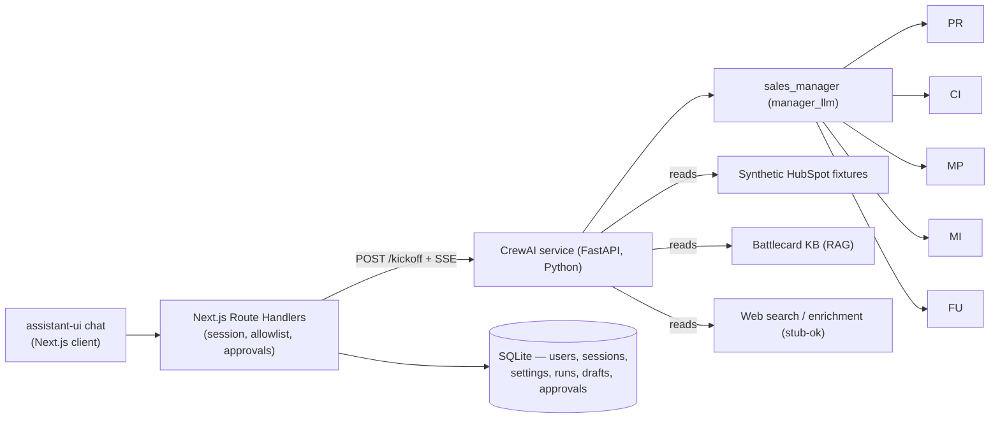
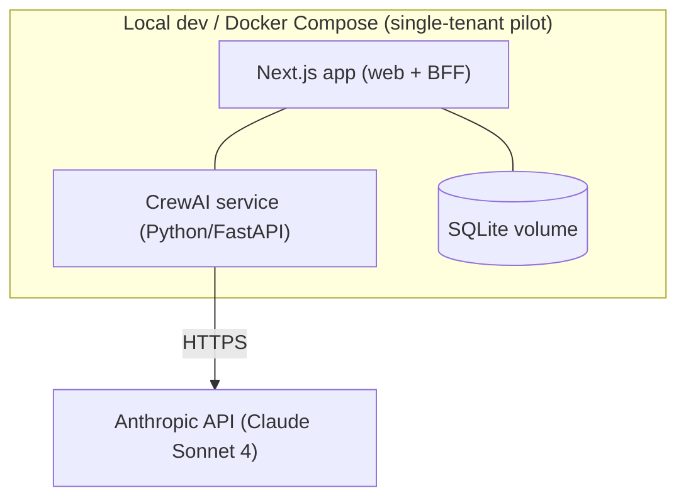
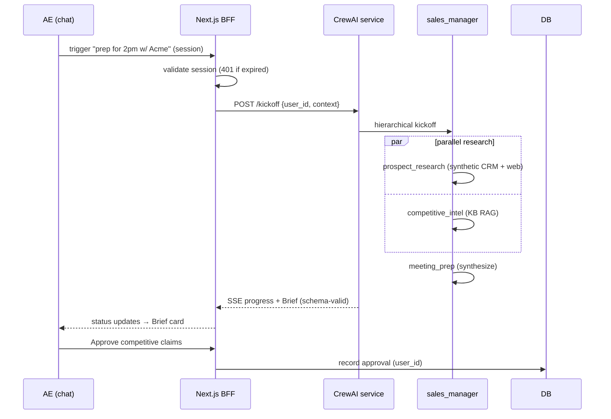
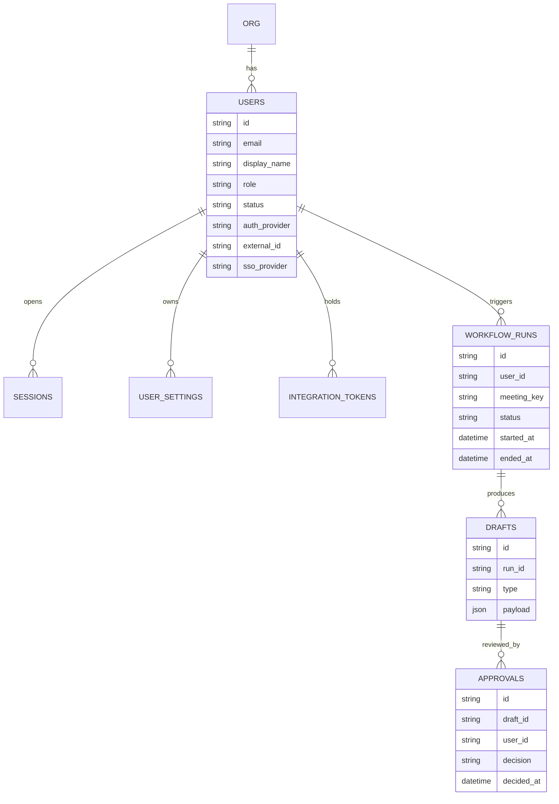

# System Architecture Document (SAD) — MVP

## Document Info

| Field | Value |
|-------|-------|
| System | Sales Enablement & Meeting Automation Crew |
| Version | 1.0 |
| Scope | **MVP (Phase 1, Sprints 1–3)** — lean architecture, essential views only |
| Selected Runtime | `crewai` (`AAMAD_TARGET_RUNTIME=crewai`) |
| LLM | Anthropic `claude-sonnet-4-20250514`, temperature `0.2` (PRD D11) |
| Input Artifacts | `PRD-2026-06-13.md` (v1.9), `MRD-v2.md`, `mrd.md` |
| Template | `.cursor/templates/sad-template.md` |
| Output Path | `project-context/1.define/sad-2026-06-13.md` |
| Author | @system.arch |

> **MVP posture:** This SAD documents only the components, views, and decisions required to deliver the P0 value loop (prep → meeting → follow-up). Enterprise NFRs, multi-tenancy, and live integrations are explicitly deferred to **Future Work** with rationale. Sections marked **[Deferred]** are intentionally out of MVP scope.

---

## Stakeholders & Concerns (ISO/IEC/IEEE 42010)

| Stakeholder | Concern | Addressed in view |
|-------------|---------|-------------------|
| Account Executive (Alex) | Fast, trustworthy briefs and drafts; private workspace | Logical, Process, UX |
| Sales Manager (Jordan) | Consistent, traceable outputs | Logical, Data, Quality Attributes |
| RevOps Admin (Riley) | Provision reps without a UI; auditability | Deployment, Data, Security |
| Backend/Integration Eng | Deterministic crew, least-privilege tools | Logical, Process, Tools |
| QA Eng | Verifiable acceptance criteria, schema-valid outputs | Quality Attributes, Testing |
| Security reviewer | No silent CRM writes, redacted PII, allowlist auth | Security & Compliance |

**Viewpoints used:** Logical (components), Process/Runtime (workflow execution), Deployment, Data. Each view below provides a primary presentation (diagram/table), an element catalog, and rationale, per SEI "Views and Beyond."

---

## 1. MVP Architecture Philosophy & Principles

**MVP design principles**
- **Prove the value loop first:** ship the P0 chain (FR-P0-01 → 07) before any live integration. Synthetic HubSpot data (D9) removes credential and sandbox dependencies.
- **Human-in-the-loop by default:** every customer-facing or CRM-bound artifact is a *draft* requiring Approve/Edit/Reject (PRD §5, MRD-v2 HITL). No silent writes.
- **Least-privilege, deterministic crew:** each agent binds only the tools it needs; temperature `0.2` for reproducible artifact generation (D11).
- **Surface-agnostic backend:** the CrewAI crew runs headless behind an API ("own the brain, stay flexible on the face" — PRD §1). The chat web app is the first and only MVP surface.
- **Single-tenant simplicity:** one `org_id` per deployment (D6); multi-tenancy deferred.

**Core vs. Future decision framework**

| Decision | MVP (this SAD) | Deferred (Future Work) |
|----------|----------------|------------------------|
| CRM data | Synthetic HubSpot fixtures (D9) | Live HubSpot OAuth read (Phase 2) |
| Sign-in | Google OAuth + allowlist (FR-P0-10) | Microsoft OAuth (Phase 2, D8); enterprise SSO (Phase 3) |
| CRM writes | Draft-only display/export (FR-P0-07) | Approve-and-commit writes (Phase 3) |
| Trigger | Manual chat trigger default (FR-P0-01) | Calendar auto-trigger (Sprint 3, FR-P0-08) |
| Deploy | Local dev + Docker, single instance | AWS App Runner, IaC, autoscale (Phase 3) |
| Persistence | SQLite (Postgres-ready schema) | Managed Postgres, replicas |

**Key technical architecture decisions** (full rationale in *Architecture Decisions* below)
- **Next.js 14 App Router** for the chat surface (Server Components for the authed shell, Client Components for the streaming chat) — matches the AAMAD MVP template and enables a thin BFF layer via Route Handlers.
- **assistant-ui** for the LLM chat experience over a custom UI: production-grade streaming, message threading, and tool-UI primitives map directly to our four output cards.
- **CrewAI hierarchical process** with a `manager_llm` coordinator: the sales workflow naturally decomposes into specialist roles with handoffs (PRD §3). Justification for hierarchical over sequential is recorded in the Audit per the CrewAI adapter rule.
- **Streaming** agent progress (researching → briefing → ready) to the UI for perceived performance within the <3 min budget.

---

## 2. Multi-Agent System Specification

### Crew composition (MVP — 6 agents)

| Agent | Role | Tools (least-privilege) | Memory | Delegation | FR |
|-------|------|-------------------------|--------|------------|-----|
| `sales_manager` | Sales Operations Coordinator | crew delegation only | true* | true | orchestrates all |
| `prospect_research` | Prospect & Account Research Analyst | CRM read (synthetic), web search, enrichment stub | false | false | FR-P0-02 |
| `competitive_intel` | Competitive Intelligence Specialist | battlecard KB RAG, limited web search | false | false | FR-P0-03 |
| `meeting_prep` | Meeting Preparation Strategist | none (synthesizes upstream) | false | false | FR-P0-04 |
| `meeting_insights` | Meeting Analysis Specialist | transcript parser (text input) | false | false | FR-P0-05 |
| `follow_up` | Follow-Up & CRM Documentation Agent | CRM read + draft stub, email template gen | false | false | FR-P0-06, 07 |

\* `sales_manager` memory is enabled for the P1 shared-deal-memory path (FR-P1-02); MVP may operate on in-session context only (PRD §3).

> Agent and task definitions are **externalized to YAML** (`config/agents.yaml`, `config/tasks.yaml`) with a `crew.py` entrypoint, per the CrewAI adapter rule. P1/P2 agents (`content_personalization`, `deal_progression`, `lead_scoring`, `outbound`) are **[Deferred]**.

### Task orchestration

Two logical pipelines triggered from the same crew:

**Pre-meeting pipeline (FR-P0-02 → 04), target < 3 min:**
```
prospect_research ─┐
                   ├─► meeting_prep ─► Pre-meeting Brief card
competitive_intel ─┘   (HITL: approve competitive claims)
```
Research and competitive intel run as **parallel research tasks** delegated by `sales_manager`; `meeting_prep` consumes both via explicit task context chaining (`Task.context`) for deterministic dependency flow.

**Post-meeting pipeline (FR-P0-05 → 07), target < 2 min:**
```
meeting_insights ─► follow_up ─► Email Draft card + CRM Draft card
                                 (HITL: approve email / CRM draft)
```

**Orchestration controls (MVP baseline, CrewAI adapter rule):**

| Control | MVP value | Rationale |
|---------|-----------|-----------|
| Process | `hierarchical` (`manager_llm`) | Coordinator/specialist domain fit (PRD §3); justified in Audit |
| `max_iter` per task | ≤ 12 | Adapter baseline |
| `max_retry_limit` | ≥ 2 (LLM failure, backoff) | PRD §5 reliability |
| `max_execution_time` | tuned per pipeline (180s prep / 120s post) | Performance targets |
| `max_rpm` | set at crew level | Budget stability (< $2/run) |
| Idempotency | workflow key = `meeting_id` (or generated run id) | PRD §5; calendar-trigger ready |
| Memory | `false` for MVP reproducibility | Adapter default; P1 enables crew memory |

**Expected outputs:** every task declares an `expected_output` with required headings; brief and CRM draft are validated against JSON schemas (see §6 / Quality Gates) before surfacing to the UI.

---

## 3. Frontend Architecture (Next.js + assistant-ui)

**Stack:** Next.js 14 (App Router), assistant-ui + shadcn/ui, Tailwind CSS, TypeScript, lightweight client state (React context/Zustand). Mobile is **not required** for the capstone (PRD §6).

**App Router structure (MVP, lean):**
```
app/
  (auth)/sign-in/page.tsx        # Google OAuth button + "access not enabled" state (FR-P0-10)
  (app)/chat/page.tsx            # assistant-ui thread; workflow trigger + output cards
  (app)/settings/page.tsx        # trigger mode, trigger window, integrations (FR-P0-09)
  (app)/layout.tsx               # authed shell (Server Component): session guard, header, sign-out
  api/
    auth/[...]/route.ts          # Auth.js (NextAuth) Google provider + allowlist callback
    workflow/route.ts            # POST kickoff → proxy/stream from crew service
    workflow/[id]/route.ts       # GET status / SSE stream of agent progress
    approvals/route.ts           # POST approve/edit/reject (attributed to user_id)
    settings/route.ts            # GET/PUT per-user settings
```

**assistant-ui integration — four tool-UI cards** (each renders a structured agent result with Approve / Edit / Reject where a HITL gate applies):

| Card | Source task | HITL gate |
|------|-------------|-----------|
| Pre-meeting Brief | `meeting_prep` | Approve competitive claims (FR-P0-03) |
| Post-meeting Summary | `meeting_insights` | none (informational) |
| Email Draft | `follow_up` | Approve before copy/export (FR-P0-06) |
| CRM Draft | `follow_up` | Approve before copy/export (FR-P0-07) |

**Streaming & status:** SSE/stream from the workflow route drives a status indicator (researching → briefing → ready) and progressively reveals cards. Each card shows **which agent produced it** (transparency) and **citations** on research/competitive claims (explainability) — PRD §6.

**Error/loading UX:** graceful fallback if enrichment is unavailable (partial brief + notice); loading skeletons per card; clear non-provisioned sign-in error.

---

## 4. Backend Architecture

**Two cooperating tiers (kept minimal):**
1. **Next.js BFF (Route Handlers / TypeScript):** owns session, auth, allowlist enforcement, per-user settings, approval recording, and proxies/streams workflow requests. All workflow/settings/approval routes require a valid session and return **401** when absent or expired (FR-P0-10).
2. **CrewAI service (Python, FastAPI):** headless crew orchestration. Exposes `POST /kickoff` (start workflow, returns run id) and a streaming progress endpoint. Loads `config/agents.yaml` + `config/tasks.yaml`; runs the hierarchical crew with Anthropic Claude.



**API contracts (contract-first):**

| Route | Method | Purpose | Auth |
|-------|--------|---------|------|
| `/api/workflow` | POST | Kickoff with meeting context (account, attendees, datetime) → `{ run_id, status }` | session |
| `/api/workflow/{id}` | GET (SSE) | Stream agent progress + completed cards | session |
| `/api/approvals` | POST | `{ run_id, artifact, decision: approve\|edit\|reject, edits? }` | session |
| `/api/settings` | GET/PUT | Per-user trigger mode, window, integrations | session |
| crew `POST /kickoff` | POST | Internal: `{ user_id, meeting_context, mode }` | service token |

**CRM integration layer:** a `CRMProvider` interface with a **`SyntheticHubSpotProvider`** implementation in MVP (reads fixtures), swappable for `LiveHubSpotProvider` in Phase 2 **without agent rework** (D9). Drafts map to HubSpot standard fields (D10): `dealstage`, `hs_next_step`, `closedate`, Note body, `associatedContactId`, `associatedDealId`.

**Auth & security (MVP):** Google OAuth via Auth.js; sign-in succeeds only if the email exists in `users` with status `active` (allowlist, D6). HTTP-only server-side session cookie; **24-hour TTL** (D7); CSRF protection on mutating routes. Secrets via env (`.env.example`): `ANTHROPIC_API_KEY`, OAuth client id/secret, session signing key.

---

## 5. DevOps & Deployment Architecture (MVP-lean)

**Deployment view:**


- **Runtime:** local dev + optional Docker Compose (two services + SQLite volume); single backend instance for the pilot (PRD §3 Infrastructure).
- **Config & secrets:** environment variables only; `.env.example` documents required keys. No secrets in artifacts/logs (aamad-core, adapter rules).
- **Provisioning (operational, not deploy):** CLI script + CSV import (FR-P0-11) seeds the `users` table; documented in `setup.md`.
- **Logging:** structured agent trace logs under `project-context/2.build/logs`, secrets/PII redacted; `user_id` logged on workflow and approval events.

**[Deferred to Future Work]:** GitHub Actions CI/CD, AWS App Runner sizing/autoscale, Terraform/IaC, blue-green/rollback, log aggregation/APM, alerting. Rationale: zero workflow value for a 6-week capstone (PRD D4); single-instance pilot is sufficient to validate the loop.

---

## 6. Data Flow & Integration Architecture

**Request/response flow (process/runtime view, pre-meeting):**


**Integration boundary (MVP):** all external systems are **read-only** (PRD §1). Synthetic HubSpot fixtures, battlecard KB (RAG), web/enrichment (stub acceptable Sprint 1). Google Calendar read is **Sprint 3** (FR-P0-08). No outbound writes anywhere in MVP.

**Output schemas (machine-ingested, validated):** Brief, Summary, Email Draft, and CRM Draft are emitted as structured JSON (CRM Draft uses the D10 HubSpot field mapping). Schema validation runs before the BFF surfaces a card; failures halt with a Diagnostic (Quality Gates).

**Analytics/feedback [minimal]:** capture workflow timestamps (for prep-time/follow-up-time metrics, PRD §7) and approval events. Advanced analytics/BI **[Deferred]**.

---

## 7. Performance & Scalability

| Requirement | MVP target | Source |
|-------------|------------|--------|
| Pre-meeting workflow | < 3 min P95 end-to-end | PRD §3/§5 |
| Post-meeting package | < 2 min P95 after transcript | PRD §3/§5 |
| Concurrent users (pilot org) | 5–50 reps, single instance | PRD §3 |
| Cost per workflow run | < USD 2.00 | PRD §7 |
| Retry on LLM failure | 2 retries, backoff | PRD §5 |
| Idempotency | same `meeting_id` → same run key | PRD §5 |

**Resource optimization:** token budget cap per workflow (temperature `0.2`); parallelize independent research tasks; stream early to mask latency. **Scalability path [Deferred]:** horizontal scaling, load balancing, Postgres read replicas, container orchestration — Phase 3 (PRD §8).

---

## 8. Security & Compliance

| Requirement | MVP implementation | Source |
|-------------|--------------------|--------|
| App authentication | Google OAuth + allowlist; no public signup | FR-P0-10, D6 |
| User provisioning | CLI + CSV only; no admin UI | FR-P0-11 |
| Session security | HTTP-only cookie, server-side store, **24h TTL**, CSRF on mutating routes | D7, PRD §5 |
| Authorization | All runs/drafts/approvals scoped to `user_id`; not visible cross-rep | FR-P0-10 |
| Secrets | Env vars only; `.env.example`; never in logs/artifacts | aamad-core |
| PII in logs | Redact emails/phone in trace logs | PRD §5 |
| CRM access | Read + draft from synthetic fixtures; no silent writes | D9, FR-P0-07 |
| Competitive claims | Mandatory approval gate; approval attributed to `user_id` | FR-P0-03 |

**Future-migration hooks:** reserve `auth_provider` (`google`|`microsoft`) and nullable `sso_provider`/`external_id` on the user record so Phase 2 Microsoft OAuth (D8) and Phase 3 SSO don't require a data migration. **[Deferred]:** GDPR tooling, SOC 2, enterprise SSO, data-subject deletion workflows (documented deferrals, PRD §5).

### Data view (ER, MVP)


Storage is **SQLite** in MVP with a Postgres-compatible schema (PRD §3). Synthetic HubSpot fixtures live as seed data, accessed via the `CRMProvider` interface (not the app DB).

---

## 9. Testing & Quality Assurance

**Testing strategy (MVP-appropriate):**
- **Unit:** agent task output schema validators; CRM field-mapping (D10); allowlist/session guards.
- **Integration:** BFF ↔ crew kickoff/stream; `SyntheticHubSpotProvider` reads; approval recording scoped to `user_id`.
- **End-to-end:** full P0 loop — sign-in → trigger → brief → approve → transcript → summary → email/CRM drafts → approve.
- **Provisioning:** CSV import idempotency + CLI add/deactivate/list (FR-P0-11).

**Quality gates (CrewAI adapter):**
- Enforce structured-output schema validation before surfacing any card; **halt with Diagnostic** on failure.
- 100% of unverified competitive claims flagged for approval (PRD §7 technical metric).
- Required artifact headings validated before write; deterministic generation (temp `0.2`).
- Human review gate on all customer-facing/CRM artifacts (`human_input` / approval task).

**Acceptance benchmarks:** task success ≥ 95%; brief completeness ≥ 90% required fields; latency targets §7. **[Deferred]:** load/perf testing, security pen-test, accessibility audit.

---

## 10. MVP Launch & Feedback Strategy (architecture support)

The architecture supports the capstone demo and 90-day pilot (PRD §9) by instrumenting:
- **Workflow timestamps** → prep-time ↓80% and time-to-follow-up <1 hr (PRD §7 leading indicators).
- **Approval events** → rep approval rate ≥ 70% (adoption proxy).
- **CRM stage-change tagging hook [Deferred to Phase 2]** for meeting→next-step conversion once live HubSpot is connected.

Beta framework, feature flags, onboarding tutorials, support/escalation, and business-intelligence dashboards are **[Deferred]** product/ops concerns, not MVP architecture (PRD §8/§9).

---

## Architecture Decisions (key)

| # | Decision | Rationale | Trace |
|---|----------|-----------|-------|
| AD-1 | CrewAI **hierarchical** process with `manager_llm` (not sequential) | Domain decomposes into coordinator + specialists with delegated handoffs; PRD §3 explicitly specifies it. Determinism preserved via task context chaining, temp 0.2, and schema gates. Justification recorded in Audit per CrewAI adapter rule. | PRD §3; adapter-crewai |
| AD-2 | Synthetic HubSpot provider behind a `CRMProvider` interface | Reliable demo with no sandbox creds; swap to live HubSpot in Phase 2 without agent rework. | D9 |
| AD-3 | Two-tier backend (Next.js BFF + Python CrewAI service) | Keeps the crew headless/surface-agnostic; isolates Python runtime from the TS web tier; minimal MVP footprint. | PRD §1 strategic posture |
| AD-4 | assistant-ui tool cards for the four artifacts | Native streaming + tool-UI maps 1:1 to Brief/Summary/Email/CRM cards with approval controls. | PRD §6 |
| AD-5 | Google OAuth + allowlist, 24h session, single org | Matches HubSpot/Google ICP; pilot-grade security without enterprise SSO. | D5, D6, D7 |
| AD-6 | SQLite now, Postgres-ready schema | Lowest MVP friction; clean migration path. | PRD §3 |

---

## MVP Exclusions (Deferred to Future Work)

Live HubSpot OAuth read (Phase 2) · Microsoft OAuth sign-in (Phase 2) · Calendar auto-trigger live OAuth (Sprint 3 within MVP, but stubbed earlier) · CRM approve-and-commit writes (Phase 3) · P1 agents (personalization, deal memory, deal risk, lead scoring) · P2 agents (live coaching, outbound) · CI/CD + AWS App Runner + IaC + APM/alerting · Multi-tenancy + admin UI + enterprise SSO/SOC 2/GDPR tooling · Mobile UI · Advanced analytics/BI dashboards.

---

## Traceability (PRD → Architecture)

| PRD FR | Architectural element |
|--------|------------------------|
| FR-P0-01 | `/api/workflow` POST + crew `/kickoff` (manual trigger) |
| FR-P0-02 | `prospect_research` agent + `CRMProvider` + web/enrichment |
| FR-P0-03 | `competitive_intel` agent + battlecard KB RAG + approval gate |
| FR-P0-04 | `meeting_prep` agent + Pre-meeting Brief card |
| FR-P0-05 | `meeting_insights` agent + transcript parser |
| FR-P0-06 | `follow_up` agent + Email Draft card + approval |
| FR-P0-07 | `follow_up` agent + CRM Draft card (D10 schema) |
| FR-P0-08 | Calendar read + auto-kickoff (Sprint 3) **[partial/deferred]** |
| FR-P0-09 | `/settings` + Settings page |
| FR-P0-10 | Auth.js Google provider + allowlist callback + session guard |
| FR-P0-11 | CLI/CSV provisioning script → `users` table |

---

## Sources

1. `project-context/1.define/PRD-2026-06-13.md` (v1.9) — primary input (FRs, decisions D1–D11, NFRs, metrics)
2. `project-context/1.define/MRD-v2.md` — JTBD priorities, P0 jobs, HITL requirements
3. `project-context/1.define/mrd.md` — quantitative market research
4. `.cursor/templates/sad-template.md` — SAD structure
5. `.cursor/rules/adapter-crewai.mdc` — runtime adapter constraints
6. ISO/IEC/IEEE 42010 (stakeholders/concerns/viewpoints); SEI "Views and Beyond" (view documentation practice)

---

## Assumptions

1. `AAMAD_TARGET_RUNTIME=crewai`; all implementation epics target CrewAI (PRD Assumption 1).
2. MVP uses synthetic HubSpot fixtures; live HubSpot is Phase 2 (D9).
3. Manual chat trigger is sufficient for Sprint 1; calendar OAuth lands Sprint 3 (D3).
4. Transcript input is pasted text/mock for FR-P0-05; no Gong (PRD Assumption 4).
5. CRM and all external systems are read-only in MVP; drafts only (PRD Assumption 5).
6. Anthropic `claude-sonnet-4-20250514`, temp 0.2, for all agents (D11).
7. Single-tenant deployment, one `org_id`; reps provisioned via CSV before go-live (D6).
8. Frontend follows the AAMAD MVP template stack (Next.js + assistant-ui); chat-first surface only (PRD §6, D4).
9. Web app only; native desktop deferred (D4).

---

## Open Questions

1. **CrewAI service transport:** SSE vs. WebSocket for streaming agent progress to the BFF — both meet MVP latency; defaulting to SSE unless bidirectional control is required.
2. **Brief/CRM JSON schema ownership:** confirm schemas are authored in the SFS (`*create-sfs`) per feature vs. inline here. Recommend SFS for FR-P0-04 and FR-P0-07.
3. **Web search/enrichment provider** for Sprint 2 (FR-P0-02): which API, or remain stubbed through the demo? (PRD allows stub.)
4. **Battlecard KB source format** for the RAG store (markdown vs. structured) — affects `competitive_intel` tool design.

> These do not block MVP scaffolding; resolve before Sprint 2 (research/competitive) implementation.

---

## Audit

| Field | Value |
|-------|-------|
| Timestamp | 2026-06-13T14:56:00-05:00 |
| Persona | @system.arch |
| Action | create-sad --mvp (v1.0) |
| Template | `.cursor/templates/sad-template.md` |
| Inputs | `PRD-2026-06-13.md` (v1.9), `MRD-v2.md`, `mrd.md` |
| Output Path | `project-context/1.define/sad-2026-06-13.md` |
| Resolved Runtime | **crewai** (`AAMAD_TARGET_RUNTIME=crewai`, default) |
| LLM / Temperature | `claude-sonnet-4-20250514` / 0.2 (per PRD D11) |
| Process-mode justification | Hierarchical chosen over adapter-default sequential because the sales workflow maps to a coordinator (`sales_manager`) delegating to specialists with explicit handoffs (PRD §3); determinism preserved via `Task.context` chaining, low temperature, and pre-surface schema validation (AD-1). |
| Scope | MVP — lean views, essential decisions, explicit deferrals listed under *MVP Exclusions* |
| Model | Claude (Cursor Agent) |
| Prompt Trace | Omitted — SAD generated from approved define-phase artifacts; no production runtime prompts executed |
